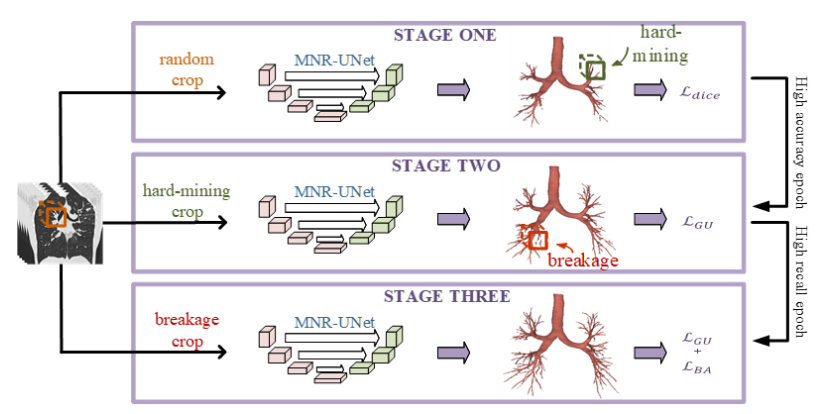
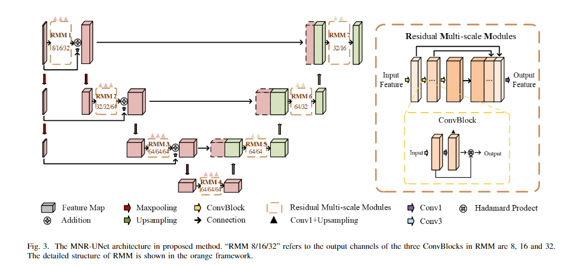

# ReadPaper

*Created by KennyS*

---

## Long-short diffeomorphism memory network for weakly-supervised ultrasound landmark tracking

**Background**

1. 本文探讨了在医学影像领域，尤其是超声影像中精确跟踪解剖标志物的重要性。由于标志物的形变、视觉模糊性和部分观察等问题，使在超声视频中精确跟踪标志物变得非常具有挑战性。然而，对于微创手术和超声引导的放射治疗等多种临床流程而言，准确跟踪标志物至关重要。

**Thinking**

1. 针对肺结节任务，肺结节切片序列之间存在连续性（结构），将其作为一个视频序列，视作为目标检测、目标跟踪任务

2. 基于跟踪模型、理论：
    - center-net
    - 马尔可夫模型

3. 可使用YOLO处理的带检测框的PNG图像，基于上述模型实验

## Anomaly-guided weakly supervised lesion segmentation on retinal OCT images

**Background**

1. 像素级别的精确标注既耗时又昂贵。弱监督语义分割（WSSS）作为一种仅使用图像级别的标签来进行分割的方法，在医学成像领域展现出巨大潜力。然而，现有的大多数WSSS方法只针对单个类别的分割，而忽略了单张图像中多种类别共存所带来的复杂性。此外，从自然图像领域迁移过来的多类别WSSS方法也无法直接应用于医疗影像，因为医疗图像中的病灶尺寸和发生频率存在较大差异。

**Thinking**

1. 如果只是得到病灶的检测框，应该是可行，弱监督在分割精度上应该是差

2. WSSS的一般过程
    - 生成像素级伪标签
    - 弱监督算法生成伪预测
    - 两者进行梯度更新

3. 图像级标注处理
    - 利用图像类别标签训练分类模型
    - 分类模型通过计算图像中对应类别的CAM当作分割伪标签的种子区域
    - 使用优化算法和扩张种子区域得到像素级分割伪标签
    - 基于分割伪标签训练传统分割算法

## Mutual learning with reliable pseudo label for semi-supervised medical image segmentation

**Background**

1. 半监督的base工作&理论
    - 一致性正则化：Consistency-Regularization 
        - 在不同级别的输入小扰动下，强制预测输出的不变性
    - 伪标签：Pseudo Labeling
        - 基于聚类假设的自训练原则，每个类别的聚类应当是紧凑相似的（熵较低）
        - 首先预测未标注数据的伪标签，然后与标注数据混合重新训练
    - 不确定性分析：Uncertainty Analysis
        - 引导模型从伪标签中捕获可靠的信息

**Method**

1. 两个子网络的相互学习来识别可靠的伪标签
    - 共享编码器：Vnet
    - 两个不同的解码器（不一样的上采样模块）

2. 比较子网络的预测置信度评判哪个伪标签更可靠
    - 类不平衡问题导致高置信度伪标签偏向于占分布主导的类别（医学图像中背景为主导类别），使用阈值效果不好。因此构建比较模型找寻更可靠的伪标签去学习，从不确定性较低的预测中学习
    - 比较两个解码器输出的置信度，选取置信度高的作为可靠伪标签，学习对象（两个解码器相互纠正）

3. 评估可靠性：类内语义一致性。在解码器中生成类原型
    - 计算倒数第二层的特征与类原型之间的余弦相似度
    - 计算余弦相似度与标签之间的距离，评判可靠性

4. 互学习机制：子网络只有在另一个子网络的预测更为可靠时才会采纳其知识

## Expectation maximisation pseudo labels

[仓库](https://github.com/moucheng2017/EM-BPL-Semi-Seg.git)

**Background**

1. 伪标签的方法和期望最大化(Expectation Maximisation)算法存在联系，提出伪标签的贝叶斯广义形式，并开发一种变分方法来生成这些标签

**Method**

1. 基于EM算法和贝叶斯定理构建框架
    - EM通过最大化似然函数来估计参数
    - 贝叶斯定理用于更新先验概率至后验概率

2. EM算法的E根据最大预测概率生成伪标签，M使用伪标签更新模型参数

## GANDALF: Graph-based transformer and Data Augmentation Active Learning Framework with interpretable features for multi-label chest Xray classification

[仓库](https://github.com/mlcommons/GaNDLF)
[文档](https://docs.mlcommons.org/GaNDLF/setup/)

**Background**

1. 在多标签设置中，图像可能具有多个疾病标签，如胸部X射线图像。在这种场景下，信息量大的样本选择更具挑战性，因为需要考虑所有潜在类别标签之间的相互影响和相似性，以及不同类别复杂性（即一些疾病比其他疾病更容易检测到）的不同水平。此外，增强这样的信息量大的样本应确保新样本的适当信息量。因此，本文提出了一种新的多标签主动学习与数据增强相结合的方法。

**Method**

1. 主动学习(Active Learning, AL):主动学习是一种机器学习方法，其中模型在训练过程中可以与标注者交互，只学习对模型训练最有帮助的样本，从而减少标注数据的需求。

2. 图神经网络（Graph Neural Networks, GNNs）：图神经网络是一种能够处理图结构数据的神经网络。通过图神经网络，可以学习节点之间的复杂关系，并用于各种任务，如节点分类、图表示学习和推荐系统。本文使用图神经网络来表示和聚合多标签学习中的疾病标签之间的关系

3. 提出了一种基于图注意力变压器的多标签样本信息度量方法，该方法量化了每个样本基于多标签交互的重要性

**Thinking**

1. 能否将主动学习和半监督技术相结合
2. 主动学习的交互方式具体是如何交互的，人为手动调整还是代码中自动进行
3. 对于训练的开销如何

## Large-Scale 3D Medical Image Pre-training with Geometric Context Priors

**Contribution**

1. 基于动量的师生模块的体积间对比学习（VoCo）
2. 自监督学习结合半监督学习，有效利用标注数据和未标注数据
3. 整合了下数据集，目前最大的数据集PreCT-160K

**Towards Omni-supervised Pre-training**

1. 实现
    - 数据
        - Labeled Segmentation $(X_{L}, Y_{L})$
        - Unlabeled data $X_{U}$
    - 结果：Pretrained Model $M$

2. First Stage
    - Fully supervised training $M \gets (X_{L}, Y_{L})$
    - Self supervised training $M \gets X_{U}[L_{SSL}]$

$$
L_{SSL} = L_{pred} + L_{reg} + L_{inter} \\
= -\frac{1}{n} \sum_{i\in n}^{n}log(1-d_{i}) + \frac{2}{n(n-1)} \sum_{i,j \in n, i \ne j}^{n} |s_{ij}| - \frac{1}{n} \sum_{i\in n}^{n} log(1-|y_{s}-y_{t}|)
$$

3. Second Stage
    - Generate pseudo labels: $Y_{U} \gets (M, X_{U})$
    - Semi supervised training $M \gets (X_{L}, Y_{L}, X_{U}, Y_{U})$
    - Self supervised training $M \gets X_{U}[L_{SSL}]$

**Thinking**

1. 越大的模型越有效吗
    - 论文实验表示：根据任务复杂情况，越复杂的任务（比如分割类别越多）越需要大规模的模型

2. 可能有关的一些变量
    - 用于微调的数量
    - 数据分布的多样性
    - 任务复杂度

3. 模型的Backbone
    - 论文认为nnunet无法修改网络（论文似乎都不会有魔改nnunet的想法？可能认为魔改之后反而会丧失性能？）
    - 使用nnunet和swin-unetr作为backbone，研究swin-unetr

4. 数据量
    - 论文的数据集从原来的10K扩展到160K，但认为性能增强微不足道，归因于数据质量和多样性、网络可扩展性可能接近上限
    - 也就是说，数据量只要到达一定的规模，也不需要太大，例如10K的样子，只要10K的数据中样本分布足够多样化、均衡，数据质量较高，就可以达到较好的效果

5. 论文还结合了点视觉语言的部分，但跟现在的任务需求没啥关系，就不去细看了

## BTCV Dataset

1. 50例腹部CT扫描，门静脉造影阶段拍摄
2. 体积范围：512x512x85 - 512x512x198
3. FOV范围：280x280x280 - 500x500x650
4. 平面分辨率：0.54x0.54 - 0.98x0.98
5. 层厚：2.5 - 5.0
6. 任务：分割
7. 模态：CT
8. Size：Train(24 + 6) + Test(20)

**标注**

|器官|标注|ID|
|:---:|:---:|:---:|
|Spleen|spleen|1|
|Right Kidney|rkid|2|
|Left Kidney|lkid|3|
|Gallbladder|gall|4|
|Esophagus|eso|5|
|Liver|liver|6|
|Stomach|sto|7|
|Aorta|aorta|8|
|IVC|IVC|9|
|Portal and Splenic Veins|veins|10|
|Pancreas|pancreas|11|
|Right adrenal gland|rad|12|
|Left adrenal gland|lad|13|

## SUES-200: A Multi-height Multi-scene Cross-view Image Benchmark Across Drone and Satellite

**Contribution**
1. 这是一篇公开数据集的论文
    - 无人机跨视图数据集
    - 多视图多高度多环境干扰
2. 提出基于数据集特征的新的评估系统, 评估模型对不同高度、不确定性的鲁棒性, 以及推理速度的鲁棒性
    - 提出一个新的指标用于评估模型对于高度的鲁棒性
    - 提出一个新的指标用于评估模型对于不确定性的鲁棒性(外界因素, 如翻转、雨雪等)
    - 推理速度指标
3. 根据各种backbone(CNN & transformer)建立一个baseline模型
    - 评估各种backbone提取特征的能力, 建立baseline
    - 消融实验
        - 超参`hidden_channels`的设置
        - 是否共享backbone的权重
        - 不同loss
        - 距离测量算法的影响
        - 特征融合策略

**Background**
1. 跨视图匹配
    - 无人机目标定位
    - 无人机导航
2. 原来的数据集不够复杂, 不能应对实际场景中复杂的外部环境
3. 另一个公共数据集paper提供数据集的同时, 也提出了baseline模型, 但不够鲁棒

## Multi-Stage Airway Segmentation in Lung CT Based on Multi-scale Nested Residual UNet

**Contribution**
1. 三阶段分割方法，保证精度与气道拓扑完整性，残差多尺度模块RMM
2. 新的损失函数wBAL(加权破坏感知)，强调预测的气道中心线与gt中心线之间的重叠，有助于破碎的中心线体素分配更大的权重，迫使网络更多地关注气道连续性
3. 

**Background**
1. 实现完整、连续的气道分割具有挑战性
2. 远端气道的小尺寸和成像噪声减少了气道腔和壁之间的对比度，导致CNN传播过程中特征消失，导致分割不连续和假阴性
3. 类不平衡，气道与背景，大气道与小气道 -> 需要专门解决气道断连的损失函数
4. 指标不足：树长检测率(TD)，分支检测率(BD)，DSC，PRE

**Method**
1. 第一阶段：随即裁剪采样+DSC预测主气道，best_epoch作为第二阶段的base
2. 第二阶段：hard-mining crop以及GU损失函数（通用联合损失函数）解决小气道分割
3. 第三阶段：解决预测的不连续性，结合wBAL以及GU损失，惩罚影响气道连续性的中心线体素

