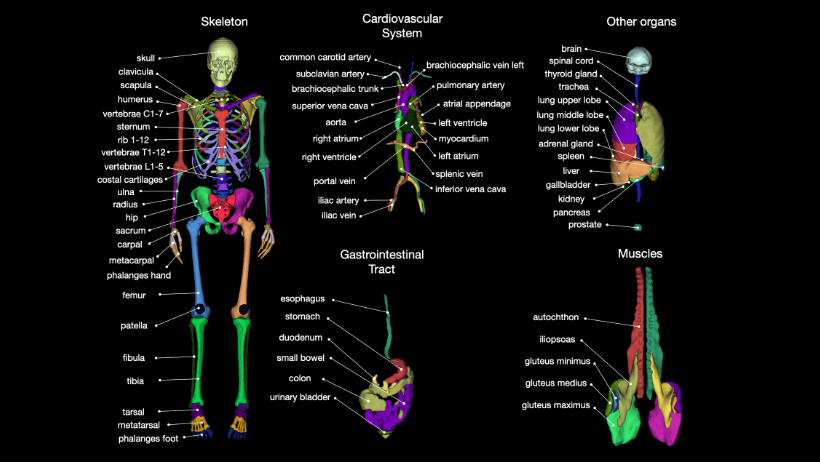
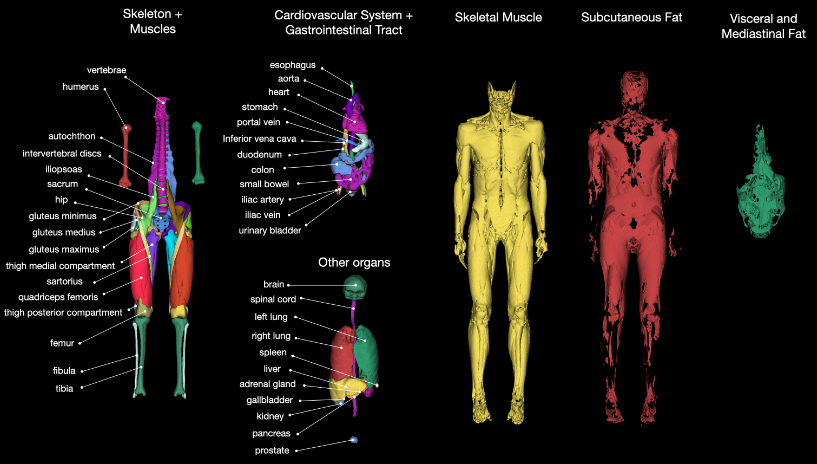

# Tutorial for nnUNetv2

*Created by KennyS*

---

## OS

- Ubuntu22.04
- win10处理较麻烦

---

## ENV

1. python (最好3.9以上, 3.7/3.8可能出bug)
2. torch
3. nnunetv2: `pip install -e .`  or  `python3 setup.py install`
    - 在代码仓库中运行setup.py, 可以修改代码然后编译
    - 直接`pip install nnunetv2`, 则将库安装在环境中, 需要到env中修改api

4. win10环境下:

```bash
# apex package
# https://github.com/NVIDIA/apex.git

pip install -v --no-cache-dir --global-option="–cpp_ext" --global-option="–cuda_ext" ./
```

或者`python3 setup.py install`

---


## USING

### 数据路径

`nnUNet_raw`, `nnUNet_preprocessed`, `nnUNet_results`

1. nnUNet路径下创建/DATASET/nnUNet_raw

- 该文件夹为每个数据集创建子文件夹DatasetXXX_YYY（XXX是3位标识符，YYY是数据集名称
- 格式
├── dataset.json
├── imagesTr
│ ├── ...
├── imagesTs
│ ├── ...
└── labelsTr
├── ...
nnUNet_raw/Dataset002_NAME2
├── dataset.json
├── imagesTr
│ ├── ...
├── imagesTs
│ ├── ...
└── labelsTr
├── ...

2. nnUNet路径下创建/DATASET/nnUNet_preprocessed
    - 保存预处理数据的文件夹, 训练过程中使用该文件夹下文件

3. nnUNet路径下创建/DATASET/nnUNet_results
    - 保存模型权重, 如下载预训练模型, 则保存在该文件夹

4. 指定环境目录
    - vim一个脚本, 避免在系统变量里定义

    ```bash
    vim setPath.sh
    #!/bin/bash
    export nnUNet_raw="/media/nunet2_folder/nnUNet_raw"
    export nnUNet_preprocessed="/media/nnunet2_folder/nnUNet_preprocessed"
    export nnUNet_results="/media/nnunet2_folder/nnUNet_trained_models"
    ```

    - 每次在终端中运行时, 需要`source setPath.sh`
    - 验证环境变量: `echo $nnUNet_results`


### 训练

1. 预处理数据制作

```bash
nnUNetv2_train DATAnnUNetv2_plan_and_preprocess -h 可查看使用帮助
nnUNetv2_plan_and_preprocess -d 131（你的数据ID） --verify_dataset_integrity
```

2. 训练

```bash
nnUNetv2_train DATASET_NAME_OR_ID UNET_CONFIGURATION FOLD [其他选项，参见 -h]
nnUNetv2_train 131 3d_fullres 1 (表示使用131这个数据集，模型用3d_fullres，训练第一折)
```

  - UNET_CONFIGURATION： 用于标识所需的 U-Net 配置（defaults: 2d, 3d_fullres, 3d_lowres, 3d_cascade_lowres）
  - DATASET_NAME_OR_ID： 指定应在其上训练的数据集
  - FOLD：指定要训练的 5 折交叉验证中的哪一个折数，0-4表示单个折数，all和5表示5折一起训练

3. 中断继续训练: `nnUNetv2_train 131 3d_fullres 1 --c`

4. MSD数据集从nnUNetv1转换到v2: `nnUNetv2_convert_MSD_dataset  -i  原数据集的路径  -overwrite_id 02`

5. nnUNetv2常用指令:

```bash
nnUNetv2_accumulate_crossval_results        nnUNetv2_find_best_configuration
nnUNetv2_apply_postprocessing               nnUNetv2_install_pretrained_model_from_zip
nnUNetv2_convert_MSD_dataset                nnUNetv2_move_plans_between_datasets
nnUNetv2_convert_old_nnUNet_dataset         nnUNetv2_plan_and_preprocess
nnUNetv2_determine_postprocessing           nnUNetv2_plan_experiment
nnUNetv2_download_pretrained_model_by_url   nnUNetv2_plot_overlay_pngs
nnUNetv2_ensemble                           nnUNetv2_predict
nnUNetv2_evaluate_folder                    nnUNetv2_predict_from_modelfolder
nnUNetv2_evaluate_simple                    nnUNetv2_preprocess
nnUNetv2_export_model_to_zip                nnUNetv2_train
nnUNetv2_extract_fingerprint
```

6. 分布式训练

    - 设置显卡: `export CUDA_VISIBLE_DEVICES=0,1`
    - 分布式训练: `nnUNetv2_train 220 2d 0 -num_gpus 2`

7. 训练验证，可以用于训练验证崩溃后继续验证
`nnUNetv2_train 4 3d_fullres 0 --val --npz`

8. 寻找最佳参数
`nnUNetv2_find_best_configuration 4 -c 2d 3d_lowres 3d_fullres -f 0 1 2 3 4`

9. 给出参数后, nnunet会给出推荐predict命令, 出现多条, 分别运行predict,然后ensemble
```
nnUNetv2_predict -d x -i x -o x -f 0 1 2 3 4 -tr nnUNetTrainer -c 2d -p nnUNetPlans --save_probabilities
nnUNetv2_predict -d x -i x -o x -f 0 1 2 3 4 -tr nnUNetTrainer -c 3d_fullres -p nnUNetPlans --save_probabilities

nnUNetv2_ensemble -i x x -o x -np 8 
```

10. 运行后处理
`nnUNetv2_apply_postprocessing -i x -o x -pp_pkl_file x`

11. 预测

`nnUNetv2_predict -i ${nnUNet_raw}/Dataset131_WORD/ImagesTs -o output -d 131 -c 3d_fullres -f 1`

---

## 深度挖掘

### nnUNet的patch训练

1. nnUNet进行小块训练，无需自己离线操作手动切割，在plans.json中修改即可
    - nnUNetPlans.json 代码片段，修改其中的参数即可

    ```yaml
    "configurations": {
        "2d": {
            "data_identifier": "nnUNetPlans_2d",
            "preprocessor_name": "DefaultPreprocessor",
            "batch_size": 12,
            "patch_size": [
                512,
                512
            ],
    ```

### Region训练

1. nnUNet的区域强化学习
    - 可进行更深入的细粒度学习，标签上细粒度区分不大，例如{增强肿瘤，非增强肿瘤}
    - dataset.json代码片段

    ```json
    "labels": {
        "background": 0,
        "edema": 1,
        "non_enhancing_and_necrosis": 2,
        "enhancing_tumor": 3
    },
    ```

    - 手动修改标注的id
    ```json
    ...
    "labels": {
        "background": 0,
        "whole_tumor": [1, 2, 3],
        "tumor_core": [2, 3],
        "enhancing_tumor": 3  # or [3]
    },
    "regions_class_order": [1, 2, 3],
    ...
    ```

### nnUNet的预训练与微调

1. 准备两个数据集，至少目前看下来，似乎得是标签一致的
    - pretraining dataset：预训练的数据集
    - finetuning dataset：微调、目标数据集

2. 训练一个预训练数据集得到预训练权重
    - 先处理一下finetuning dataset：`nnUNetv2_plan_and_preprocess -d FINETUNING_DATASET`
    - 生成预训练数据集的fingerprint：`nnUNetv2_extract_fingerprint -d PRETRAINING_DATASET`
    - 将目标数据集的训练plan计划用于预训练数据集
        - `nnUNetv2_move_plans_between_datasets -s FINETUNING_DATASET -t PRETRAINING_DATASET -sp FINETUNING_PLANS_IDENTIFIER -tp PRETRAINING_PLANS_IDENTIFIER`
        - 此处的PLANS_IDENTIFIER就是预处理过程中生成的`nnUNetPlans.json`，代码中无需加json后缀
    - 训练预训练数据集
        - `nnUNetv2_preprocess -d PRETRAINING_DATASET -plans_name PRETRAINING_PLANS_IDENTIFIER`
        - `nnUNetv2_train PRETRAINING_DATASET CONFIG all -p PRETRAINING_PLANS_IDENTIFIER`

3. 使用预训练权重训练目标数据集
    - `nnUNetv2_train FINETUNING_DATASET CONFIG FOLD -pretrained_weights PATH_TO_CHECKPOINT`

### 训练级联nnunet模型

1. 数据preprocess
    - 需要准备3d数据集（fullres+lowres）

2. 需要跑完五折（0，1，2，3，4）的3d_lowres模型，比较费时间
    - 跑完一折后，会在对应的文件夹内生成predict_next_stage文件夹

3. 训练完五折lowres后，训练级联模型
`nnUNetv2_train DATASET_NAME_OR_ID 3d_cascade_fullres FOLD [--npz]`

### 涂鸦标签训练

1. 修改dataset.json即可

```json
"labels": {
        "background": 0,
        "Heart": 1,
        "Liver": 2,
        "Spleen": 3,
        "Left Upper Lobe": 4,
        "Kidney": 5,
        "Pancreas": 6,
        "Vessels": 7,
        "Spine": 8,
        "Bone": 9,
        "Pulmonary Vein": 10,
        "Airways": 11,
        "Lung Nodules": 12,
        "Pneumonia": 13,
        "Left Lower Lobe": 14,
        "Right Upper Lobe": 15,
        "Right Middle Lobe": 16,
        "Right Lower Lobe": 17,
        "Pulmonary Artery": 18,
        "Skin": 19,
        "Body Extremities": 20,
        "ignore": 21 # 非真实标签
    },
    "numTraining": 2275,
    "file_ending": ".nii.gz"
```

---


## 魔改nnUNet模型

### 参考

[B站up](https://www.bilibili.com/video/BV1RZ421e7g9/?spm_id_from=333.337.search-card.all.click&vd_source=f007ff194d374ddfb484e469e9ee2e1f)
[csdn](https://justld.blog.csdn.net/?type=blog)

### 网络结构

1. nnUNet如何导入网络结构
    - `repo/nnUNet/nnunetv2/utilities/get_network_from_plans.py`
    - `get_network_from_plans.py`根据`nnUNetPlans.json`解析网络结构
        - configuration：2d，寻找下面的architecture（）

        ```yaml
        "architecture": {
            "network_class_name": "dynamic_network_architecture.architectures.unet.PlainConvUNet"
        }    
        ```

2. 修改思路
    - 自己编写网络结构
    - 修改json中的类名

3. nnUNet的网络结构定义并不在nnunet仓库中
    - nnUNet网络结构仓库
    - 代码为`repo/dynamic-network-architectures/dynamic_network_architectures/architectures/unet.py`

4. 安装网络结构的库
    - 克隆网络结构仓库，进入仓库
    - 激活nnunet虚拟环境，pip install -e .

5. 在architectures目录下创建自定义的网络结构`myunet.py`

```python
from typing import List, Tuple, Type
from torch.nn.modules import Module
from torch.nn.modules.conv import _ConvNd
from torch.nn.modules.dropout import _DropoutNd
from .unet import PlainConvUNet

"""
简单实现
继承PlainConvUNet类
"""

class MyUNet(PlainConvUNet):
    def __init__(self, *args, **kwargs):
        super().__init__(*args, **kwargs)

        print('Custom MyUNet ....')

    def forward(self, x):
        return super().forward(x) 
```

6. 然后修改json文件

### 学习率、优化器

1. 基于`repo/nnUNet/nnunetv2/training/nnUNetTrainer/nnUNetTrainer.py`重写`Trainer.py`

2. 原始`Trainer.py`使用SGD+lr线性衰减，重写`nnUNetTrainerCosAnneal.py`

```python
from torch import device
from torch._C import device
from torch.optim.lr_scheduler import CosineAnnealingLR
from torch.optim import Adam, AdamW
from nnunetv2.training.nnUNetTrainer.nnUNetTrainer import *

class nnUNetTrainerCosAnneal(nnUNetTrainer):
    def __init__(self, plans: dict, configuration: str, fold: int, dataset_json: dict, unpack_dataset: bool = True, device: device = ...):
        super().__init__(plans, configuration, fold, dataset_json, unpack_dataset, device)

    def configure_optimizers(self):
        optimizer = AdamW(self.network.parameters(),
                          lr=self.initial_lr,
                          weight_decay=self.weight_decay,
                          amsgrad=True)
        
        lr_scheduler = PolyLRScheduler(optimizer, self.initial_lr, self.num_epochs)
        return optimizer, lr_scheduler

    def on_train_epoch_start(self):
        self.network.train()
        # self.lr_scheduler.step() #don't need call lr_scheduler.step() in this function
        self.print_to_log_file('')
        self.print_to_log_file(f'Epoch {self.current_epoch}')
        self.print_to_log_file(
            f"Current learning rate: {np.round(self.optimizer.param_groups[0]['lr'], decimals=5)}")
        # lrs are the same for all workers so we don't need to gather them in case of DDP training
        self.logger.log('lrs', self.optimizer.param_groups[0]['lr'], self.current_epoch)

    def train_step(self, batch: dict) -> dict:
        data = batch['data']
        target = batch['target']

        data = data.to(self.device, non_blocking=True)
        if isinstance(target, list):
            target = [i.to(self.device, non_blocking=True) for i in target]
        else:
            target = target.to(self.device, non_blocking=True)

        self.optimizer.zero_grad(set_to_none=True)
        # Autocast is a little bitch.
        # If the device_type is 'cpu' then it's slow as heck and needs to be disabled.
        # If the device_type is 'mps' then it will complain that mps is not implemented, even if enabled=False is set. Whyyyyyyy. (this is why we don't make use of enabled=False)
        # So autocast will only be active if we have a cuda device.
        with autocast(self.device.type, enabled=True) if self.device.type == 'cuda' else dummy_context():
            output = self.network(data)
            # del data
            l = self.loss(output, target)

        if self.grad_scaler is not None:
            self.grad_scaler.scale(l).backward()
            self.grad_scaler.unscale_(self.optimizer)
            torch.nn.utils.clip_grad_norm_(self.network.parameters(), 12)
            self.grad_scaler.step(self.optimizer)
            self.grad_scaler.update()
        else:
            l.backward()
            torch.nn.utils.clip_grad_norm_(self.network.parameters(), 12)
            self.optimizer.step()
        self.lr_scheduler.step() # add lr_scheduler.step() after optimizer.step()
        return {'loss': l.detach().cpu().numpy()}
```

3. 训练时选择这个Trainer
`nnUNetV2_train 002 2d 0 -tr nnUNetTrainerCosAnneal`

### 重写Planner

1. nnunetv1代码重构到v2有难度，网络结构、处理器等代码改动较大

2. 基于v2的default_experiment_planner.py的默认ExperimentPlanner重构Planner

3. 简易实现

```python
class ExperimentPlannerFlare22(ExperimentPlanner):
    def __init__(self, dataset_name_or_id: str | int, gpu_memory_target_in_gb: float = 8, preprocessor_name: str = 'DefaultPreprocessor', plans_name: str = 'nnUNetPlans', overwrite_target_spacing: List[float] | Tuple[float] = None, suppress_transpose: bool = False):
        super().__init__(dataset_name_or_id, gpu_memory_target_in_gb, preprocessor_name, plans_name, overwrite_target_spacing, suppress_transpose)

    def plan_experiment(self):
        return super().plan_experiment()

if __name__ == '__main__':
    ExperimentPlannerFlare22(2, 8).plan_experiment()
```

### 数据增强

- 应对实际数据包含各种体位（俯卧、仰卧、侧卧）的问题，降低模型对体位信息的敏感度

#### 离线数据增强

1. 通过手动增强，进行离线数据增强

    - 通过手动选取位面(axis)进行随机的旋转角度
    - 随即进行ct值的变换(30-50HU)

    ```python
    def rotate_image(image, angle, axis, is_mask=False):
        """
        Rotate the image by the specified angle around the given axis.
        Parameters:
            image (SimpleITK.Image): The image to rotate.
            angle (float): Angle of rotation in degrees.
            axis (int): The axis around which to rotate (0: Sagittal, 1: Coronal).
            is_mask (bool): If True, uses nearest neighbor interpolation (for masks).
        Returns:
            SimpleITK.Image: Rotated image.
        """
        radians = np.deg2rad(angle)
        euler_transform = sitk.Euler3DTransform()
        
        # Set rotation parameters based on the axis
        if axis == 0:  # Sagittal plane
            euler_transform.SetRotation(radians, 0.0, 0.0)
        elif axis == 1:  # Coronal plane
            euler_transform.SetRotation(0.0, radians, 0.0)
        else:
            raise ValueError("Axis must be 0 (sagittal) or 1 (coronal)")
        
        # Rotate around the center of the image
        euler_transform.SetCenter(image.TransformContinuousIndexToPhysicalPoint(
            np.array(image.GetSize()) / 2.0))
        
        # Select interpolation method based on whether the image is a mask
        interpolation = sitk.sitkNearestNeighbor if is_mask else sitk.sitkLinear
        return sitk.Resample(image, image, euler_transform, interpolation, 0.0, image.GetPixelID())

    def augment_ct_and_mask(ct_path, mask_path, fake_ct_dir, fake_mask_dir):
        """
        Perform augmentation by rotating in coronal and sagittal planes, and save the results.
        Parameters:
            ct_path (str): Path to the original CT image.
            mask_path (str): Path to the original mask.
            fake_ct_dir (str): Directory to save augmented CT images.
            fake_mask_dir (str): Directory to save augmented mask images.
        """
        ct_image = sitk.ReadImage(ct_path)
        mask_image = sitk.ReadImage(mask_path)
        
        angles = [30, 60, 180]
        axes = [0, 1]  # 0: Sagittal, 1: Coronal

        seriesuid = os.path.basename(ct_path).split('.nii.gz')[0]
        
        for angle in angles:
            for axis in axes:
                augmented_ct = rotate_image(ct_image, angle, axis, is_mask=False)
                augmented_mask = rotate_image(mask_image, angle, axis, is_mask=True)
                
                # Create file names based on seriesuid, angle, and axis
                suffix = f"{angle}_{'sagittal' if axis == 0 else 'coronal'}"
                augmented_ct_path = os.path.join(fake_ct_dir, f"{seriesuid}.{suffix}.nii.gz")
                augmented_mask_path = os.path.join(fake_mask_dir, f"{seriesuid}.{suffix}.nii.gz")
                
                # Save augmented images
                sitk.WriteImage(augmented_ct, augmented_ct_path)
                sitk.WriteImage(augmented_mask, augmented_mask_path)
    ```

#### 在线数据增强

1. 使用nnunet自带的数据增强方式`nnUNet/nnunetv2/training/nnUNetTrainer/variants/data_augmentation`
2. 训练过程中通过在线增强的方式进行数据增强
3. 具体变换方法有多个trainer，大致变换方式和离线增强差不多，训练时指定`-tr name_trainer`

---

## TotalSegmentator

### 参考

[TotalSegmentator仓库](TotalSegmentator)

### CT与MRI分割





### 安装

- Python >=3.9
- Pytorch >= 2.0.0
- pip install TotalSegmentator

### CT分割任务

#### 需要

1. 首先需要下载权重

#### 命令行模式

1. `TotalSegmentator -i ct.nii.gz -o segmentations -ta <task_name>`

2. 编写python脚本，调用命令行
    ```python
    import subprocess
    import os
    from tqdm import tqdm

    os.environ["CUDA_VISIBLE_DEVICES"] = "0"
    # 遍历路径下的所有文件
    for file_name in tqdm(os.listdir(dst_path)):
        if file_name.endswith(".nii.gz"):
            seriesuid = file_name.split('.nii.gz')[0]  # 去掉".nii.gz"部分
            input_file = os.path.join(dst_path, file_name)
            
            output_dir = os.path.join(output_path, seriesuid)
            # if not os.path.exists(output_dir):
            #     os.makedirs(output_dir)

            # 构建命令
            command = [
                "TotalSegmentator",
                "-i", input_file,
                "-o", output_dir,
                "-ta", "lung_vessels",
                "--ml" # 合并分割结果
            ]
            # 打印并执行命令
            print(f"Running command: {' '.join(command)}")
            subprocess.run(command)
    ```

3. 注意问题，保存时会保存在一个文件夹路径内，需要修改

#### Python_api

1. 减少IO，加快速度

2. 代码
    ```python
    import nibabel as nib
    from totalsegmentator.python_api import totalsegmentator
    import os

    os.environ["CUDA_VISIBLE_DEVICES"] = "0"

    if __name__ == "__main__":

        ct_dir = "/home/kennys/experiment/Vessels/processing/Dataset305_LungLobe/compare/ct"
        # ct_list = []
        output_dir = "/home/kennys/experiment/Vessels/processing/totalseg/test"

        for ct_file in os.listdir(ct_dir):

            input_file_path = os.path.join(ct_dir, ct_file)
            input_img = sitk.ReadImage(input_file_path)
            output_path = os.path.join(output_dir, ct_file)

            output_img = totalsegmentator(
                input=input_file_path,
                output=output_path,
                task='body'
            )
    ```

3. 注意, TotalSegmentator使用nib库进行开发，而不是sitk

### 其他

1. 下载权重
    - `totalseg_download_weights -t <task_name>`

2. 合并分割结果
    - `totalseg_combine_masks -i totalsegmentator_output_dir -o combined_mask.nii.gz -m lungcomm `

3. 离线使用权重
    - `~/.totalsegmentator/nnunet/resultsexport `
    - `TOTALSEG_HOME_DIR=/new/path/.totalsegmentator~/.totalsegmentator`

---

## U-Mamba

### 环境

1. Only in linux
    - Ubuntu22.04
2. python>=3.10
3. torch>=2.0.1
4. cuda11.8, 其他cuda版本可能会有问题
    ```bash
    1. conda env: create -n umamba python=3.10 -y && conda activate umamba
    2. torch: pip install torch==2.1.1 torchvision==0.16.1 --index-url https://download.pytorch.org/whl/cu118
    3. causal_conv1d:
    wget https://github.com/Dao-AILab/causal-conv1d/releases/download/v1.1.3.post1/causal_conv1d-1.1.3.post1+cu118torch2.1cxx11abiFALSE-cp310-cp310-linux_x86_64.whl
    pip install causal_conv1d-1.1.3.post1+cu118torch2.1cxx11abiFALSE-cp310-cp310-linux_x86_64.whl 
    4. mamba: 
    wget https://github.com/state-spaces/mamba/releases/download/v1.1.1/mamba_ssm-1.1.1+cu118torch2.1cxx11abiFALSE-cp310-cp310-linux_x86_64.whl
    pip install mamba_ssm-1.1.1+cu118torch2.1cxx11abiFALSE-cp310-cp310-linux_x86_64.whl 
    5. git repo: git clone https://github.com/bowang-lab/U-Mamba
    6. cd U-Mamba/umamba &&  pip install -e .
    ```

### 使用

#### 环境变量

- 和nnunet环境类似

#### 数据准备

- 与nnUNetv2类似, 将用于nnUNetv2训练的数据迁移至数据路径下即可
`nnUNetv2_plan_and_preprocess -d DATASET_ID --verify_dataset_integrity`

#### 模型

**Train 2d Models**

1. Train 2d U-Mamba_Bot Model
`nnUNetv2_train DATASET_ID 2d all -tr nnUNetTrainerUMambaBot`

2. Train 2d U-Mamba_Enc Model
`nnUNetv2_train DATASET_ID 2d all -tr nnUNetTrainerUMambaEnc`

**Train 3d Models**
3. Train 3d U-Mamba_Bot Model
`nnUNetv2_train DATASET_ID 3d_fullres all -tr nnUNetTrainerUMambaBot`

4. Train 3d U-Mamba_Enc Model
`nnUNetv2_train DATASET_ID 3d_fullres all -tr nnUNetTrainerUMambaEnc`

**Inference**
5. Predict with U-Mamba_Bot Model
`nnUNetv2_predict -i INPUT_FOLDER -o OUTPUT_FOLDER -d DATASET_ID -c CONFIGURATION -f all -tr nnUNetTrainerUMambaBot --disable_tta`

6. Predict with U-Mamba_Enc Model
`nnUNetv2_predict -i INPUT_FOLDER -o OUTPUT_FOLDER -d DATASET_ID -c CONFIGURATION -f all -tr nnUNetTrainerUMambaEnc --disable_tta`

7. Configuration: {2d, 3d_fullres}

### Reference

1. Paper

    ```
    @article{U-Mamba,
        title={U-Mamba: Enhancing Long-range Dependency for Biomedical Image Segmentation},
        author={Ma, Jun and Li, Feifei and Wang, Bo},
        journal={arXiv preprint arXiv:2401.04722},
        year={2024}
    }
    ```

2. 修改参数: 与nnUNetv2不同, 可直接在U-Mamba代码中修改模型参数

3. Code

    - U-Mamba
    - Vision-Mamba
    - Mamba
    - nnUNet

### Note

1. pip安装causal_conv1d时遇到问题, 下载源码编译
    ```bash
    git clone https://github.com/Dao-AILab/causal-conv1d.git
    cd causal_conv1d
    git checkout v1.0.2  this is the highest compatible version allowed by Mamba
    CAUSAL_CONV1D_FORCE_BUILD=TRUE pip install .
    ```

2. 训练Mamba_Enc模型会有问题, 只训练Mamba_Bot模型

3. 训练Mamba_Bot模型时, 指标先高再低至0, 调整学习率, 调至原lr的1/10

---

## 一些备注

1. 配置一些变量
    - nnUNet_n_proc_DA=0 
    - CUDA_VISIBLE_DEVICES=0
    - export MKL_SERVICE_FORCE_INTEL=1
    - export MKL_THREADING_LAYER=GNU

2. 预测结果全黑
    - mask通过归一化到0-1，图像*255即可
    
3. nnUNet的batchsize根据数据集以及显存大小自动计算，手动调整没有意义


## nnUNetv1

### 目录结构

- DATASET
    - nnUNet_preprocessed
    - nnUNet_raw
        - nnUNet_cropped_data
        - nnUNet_raw_data
    - nnUNet_trained_models

### 环境变量

```
export nnUNet_raw_data_base="/media/fabian/nnUNet_raw_data_base"
export nnUNet_preprocessed="/media/fabian/nnUNet_preprocessed"
export RESULTS_FOLDER="/media/fabian/nnUNet_trained_models"
```

### 数据结构

```
nnUNet_raw_data_base/nnUNet_raw_data/Task002_Heart
├── dataset.json
├── imagesTr
│   ├── la_003_0000.nii.gz
│   ├── la_004_0000.nii.gz
│   ├── ...
├── imagesTs
│   ├── la_001_0000.nii.gz
│   ├── la_002_0000.nii.gz
│   ├── ...
└── labelsTr
    ├── la_003.nii.gz
    ├── la_004.nii.gz
    ├── ...
nnUNet_raw_data_base/nnUNet_raw_data/Task005_Prostate/
├── dataset.json
├── imagesTr
│   ├── prostate_00_0000.nii.gz
│   ├── prostate_00_0001.nii.gz
│   ├── ...
├── imagesTs
│   ├── prostate_03_0000.nii.gz
│   ├── prostate_03_0001.nii.gz
│   ├── ...
└── labelsTr
    ├── prostate_00.nii.gz
    ├── prostate_01.nii.gz
    ├── ...
```

### 如何将数据转换成nnunetv1的格式

#### 第一种

**数据结构**

- testing
    - input
    - output
- training
    - input
    - output

1. 其中，input放置img，output放置mask
2. 在`nnUNet_raw_data`下创建`Task_xx`

3. 转换代码
```python
import numpy as np
from batchgenerators.utilities.file_and_folder_operations import *
from nnunet.dataset_conversion.utils import generate_dataset_json
from nnunet.paths import nnUNet_raw_data, preprocessing_output_dir
from nnunet.utilities.file_conversions import convert_2d_image_to_nifti

if __name__ == '__main__':
    nnUNet_raw_data = 替换为nnUNet_raw_data路径 # 备选
    """
    nnU-Net was originally built for 3D images. It is also strongest when applied to 3D segmentation problems because a 
    large proportion of its design choices were built with 3D in mind. Also note that many 2D segmentation problems, 
    especially in the non-biomedical domain, may benefit from pretrained network architectures which nnU-Net does not
    support.
    Still, there is certainly a need for an out of the box segmentation solution for 2D segmentation problems. And 
    also on 2D segmentation tasks nnU-Net cam perform extremely well! We have, for example, won a 2D task in the cell 
    tracking challenge with nnU-Net (see our Nature Methods paper) and we have also successfully applied nnU-Net to 
    histopathological segmentation problems. 
    Working with 2D data in nnU-Net requires a small workaround in the creation of the dataset. Essentially, all images 
    must be converted to pseudo 3D images (so an image with shape (X, Y) needs to be converted to an image with shape 
    (1, X, Y). The resulting image must be saved in nifti format. Hereby it is important to set the spacing of the 
    first axis (the one with shape 1) to a value larger than the others. If you are working with niftis anyways, then 
    doing this should be easy for you. This example here is intended for demonstrating how nnU-Net can be used with 
    'regular' 2D images. We selected the massachusetts road segmentation dataset for this because it can be obtained 
    easily, it comes with a good amount of training cases but is still not too large to be difficult to handle.
    """

    # download dataset from https://www.kaggle.com/insaff/massachusetts-roads-dataset
    # extract the zip file, then set the following path according to your system:
    base = 本地数据路径，training的上一级目录
    # this folder should have the training and testing subfolders

    # now start the conversion to nnU-Net:
    task_name = 'Task01_XXX'  # 任务名，自定义
    target_base = join(nnUNet_raw_data, task_name)
    target_imagesTr = join(target_base, "imagesTr")
    target_imagesTs = join(target_base, "imagesTs")
    target_labelsTs = join(target_base, "labelsTs")
    target_labelsTr = join(target_base, "labelsTr")

    maybe_mkdir_p(target_imagesTr)
    maybe_mkdir_p(target_labelsTs)
    maybe_mkdir_p(target_imagesTs)
    maybe_mkdir_p(target_labelsTr)

    # convert the training examples. Not all training images have labels, so we just take the cases for which there are
    # labels
    labels_dir_tr = join(base, 'training', 'output')
    images_dir_tr = join(base, 'training', 'input')
    training_cases = subfiles(labels_dir_tr, suffix='.png', join=False)
    for t in training_cases:
        unique_name = t[:-4]  # just the filename with the extension cropped away, so img-2.png becomes img-2 as unique_name
        input_segmentation_file = join(labels_dir_tr, t)
        input_image_file = join(images_dir_tr, t)

        output_image_file = join(target_imagesTr, unique_name)  # do not specify a file ending! This will be done for you
        output_seg_file = join(target_labelsTr, unique_name)  # do not specify a file ending! This will be done for you

        # this utility will convert 2d images that can be read by skimage.io.imread to nifti. You don't need to do anything.
        # if this throws an error for your images, please just look at the code for this function and adapt it to your needs
        convert_2d_image_to_nifti(input_image_file, output_image_file, is_seg=False)

        # the labels are stored as 0: background, 255: road. We need to convert the 255 to 1 because nnU-Net expects
        # the labels to be consecutive integers. This can be achieved with setting a transform
        convert_2d_image_to_nifti(input_segmentation_file, output_seg_file, is_seg=True,
                                  transform=lambda x: (x == 255).astype(int))

    # now do the same for the test set
    labels_dir_ts = join(base, 'testing', 'output')
    images_dir_ts = join(base, 'testing', 'input')
    testing_cases = subfiles(labels_dir_ts, suffix='.png', join=False)
    for ts in testing_cases:
        unique_name = ts[:-4]
        input_segmentation_file = join(labels_dir_ts, ts)
        input_image_file = join(images_dir_ts, ts)

        output_image_file = join(target_imagesTs, unique_name)
        output_seg_file = join(target_labelsTs, unique_name)

        convert_2d_image_to_nifti(input_image_file, output_image_file, is_seg=False)
        convert_2d_image_to_nifti(input_segmentation_file, output_seg_file, is_seg=True,
                                  transform=lambda x: (x == 255).astype(int))

    # finally we can call the utility for generating a dataset.json
    generate_dataset_json(join(target_base, 'dataset.json'), target_imagesTr, target_imagesTs, ('Red', 'Green', 'Blue'),
                          labels={0: 'background', 1: 'class1', 2: 'class2'}, dataset_name=task_name, license='hands off!')

    """
    once this is completed, you can use the dataset like any other nnU-Net dataset. Note that since this is a 2D
    dataset there is no need to run preprocessing for 3D U-Nets. You should therefore run the 
    `nnUNet_plan_and_preprocess` command like this:
    
    > nnUNet_plan_and_preprocess -t 120 -pl3d None
    
    once that is completed, you can run the trainings as follows:
    > nnUNet_train 2d nnUNetTrainerV2 120 FOLD
    
    (where fold is again 0, 1, 2, 3 and 4 - 5-fold cross validation)
    
    there is no need to run nnUNet_find_best_configuration because there is only one model to choose from.
    Note that without running nnUNet_find_best_configuration, nnU-Net will not have determined a postprocessing
    for the whole cross-validation. Spoiler: it will determine not to run postprocessing anyways. If you are using
    a different 2D dataset, you can make nnU-Net determine the postprocessing by using the
    `nnUNet_determine_postprocessing` command
    """
```

#### 第二种

自己编写`dataset.json`
```
{
    "name": "lung",
    "description": "lung",
    "tensorImageSize": "3D",
    "reference": "rc",
    "licence": "rc",
    "release": "0.0",
    "modality": {
        "0": "CT"
    },
    "labels": {
        "0": "background",
        "1": "lung"
    },
    "numTraining": 278,
    "numTesting": 70,
    "training":[
        {
            "image": "path",
            "label": "path"
        },
        {
            ...
        }
    ],
    "test": []
}
```