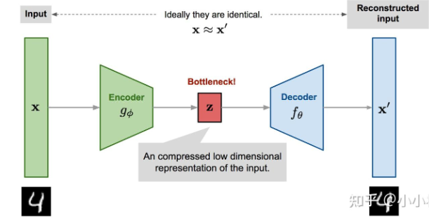

# 动手学深度学习

*Created by KennyS*

---


## 微调

1. 数据集
    - Fashion-MNIST：6w+
    - ImageNet：1000w+, 1000classes

2. 假定我们拥有数据集数量介于两者之间
    - 适用于ImageNet的复杂模型可能会在我们的数据集上过拟合
    - 而我们的数据集数量有限，训练模型的准确性无法满足实际要求

3. 解决方案
    - 收集更多的数据，但成本高
    - 迁移学习：将源数据集学习到的知识迁移到目标数据集。尽管ImageNet数据集中的大多数图像与椅子无关，但在此数据集上训练的模型可能会提取更通用的图像特征，这有助于识别边缘、纹理、形状和对象组合。 这些类似的特征也可能有效地识别椅子。

### 步骤

1. 在源数据集（例如ImageNet数据集）上预训练神经网络模型，即源模型。

2. 创建一个新的神经网络模型，即目标模型。这将复制源模型上的所有模型设计及其参数（输出层除外）。我们假定这些模型参数包含从源数据集中学到的知识，这些知识也将适用于目标数据集。我们还假设源模型的输出层与源数据集的标签密切相关；因此不在目标模型中使用该层。

3. 向目标模型添加输出层，其输出数是目标数据集中的类别数。然后随机初始化该层的模型参数。

4. 在目标数据集（如椅子数据集）上训练目标模型。输出层将从头开始进行训练，而所有其他层的参数将根据源模型的参数进行微调。

5. 当目标数据集比源数据集小得多时，微调有助于提高模型的泛化能力。

### 示例

1. 基于ImageNet训练的ResNet-18微调自己的数据集
2. 特征层参数使用预训练权重，修改分类层（输出类别数）
3. 在目标数据集较小的情况下，使用小学习率微调

    ```python
    pretrained_net = torchvision.models.resnet18(pretrained=True)
    finetune_net = torchvision.models.resnet18(pretrained=True)
    finetune_net.fc = nn.Linear(finetune_net.fc.in_features, 2)
    nn.init.xavier_uniform_(finetune_net.fc.weight) # 初始化分类层的参数

    # 如果param_group=True，输出层中的模型参数将使用十倍的学习率
    def train_fine_tuning(net, learning_rate, batch_size=128, num_epochs=5,
                        param_group=True):
        train_iter = torch.utils.data.DataLoader(torchvision.datasets.ImageFolder(
            os.path.join(data_dir, 'train'), transform=train_augs),
            batch_size=batch_size, shuffle=True)
        test_iter = torch.utils.data.DataLoader(torchvision.datasets.ImageFolder(
            os.path.join(data_dir, 'test'), transform=test_augs),
            batch_size=batch_size)
        devices = d2l.try_all_gpus()
        loss = nn.CrossEntropyLoss(reduction="none")
        if param_group:
            params_1x = [param for name, param in net.named_parameters()
                if name not in ["fc.weight", "fc.bias"]]
            trainer = torch.optim.SGD([{'params': params_1x},
                                    {'params': net.fc.parameters(),
                                        'lr': learning_rate * 10}],
                                    lr=learning_rate, weight_decay=0.001)
        else:
            trainer = torch.optim.SGD(net.parameters(), lr=learning_rate,
                                    weight_decay=0.001)
        d2l.train_ch13(net, train_iter, test_iter, loss, trainer, num_epochs,
                    devices)

    train_fine_tuning(finetune_net, 5e-5)
    ```

---

## 目标检测

1. 得到目标类别 + 位置

### 边界框

1. 描述目标空间位置，矩形
    - 左上角和右下角的x，y
    - 边界框中心的(x, y)以及框的宽度、高度
    - 坐标系原点在左上角, x轴向右为正, y轴向下为正

    ```python
    #@save
    def box_corner_to_center(boxes):
        """从（左上，右下）转换到（中间，宽度，高度）"""
        x1, y1, x2, y2 = boxes[:, 0], boxes[:, 1], boxes[:, 2], boxes[:, 3]
        cx = (x1 + x2) / 2
        cy = (y1 + y2) / 2
        w = x2 - x1
        h = y2 - y1
        boxes = torch.stack((cx, cy, w, h), axis=-1)
        return boxes

    #@save
    def box_center_to_corner(boxes):
        """从（中间，宽度，高度）转换到（左上，右下）"""
        cx, cy, w, h = boxes[:, 0], boxes[:, 1], boxes[:, 2], boxes[:, 3]
        x1 = cx - 0.5 * w
        y1 = cy - 0.5 * h
        x2 = cx + 0.5 * w
        y2 = cy + 0.5 * h
        boxes = torch.stack((x1, y1, x2, y2), axis=-1)
        return boxes

    #@save
    def bbox_to_rect(bbox, color):
        # 将边界框(左上x,左上y,右下x,右下y)格式转换成matplotlib格式：
        # ((左上x,左上y),宽,高)
        return d2l.plt.Rectangle(
            xy=(bbox[0], bbox[1]), width=bbox[2]-bbox[0], height=bbox[3]-bbox[1],
            fill=False, edgecolor=color, linewidth=2)
    ```

### 锚框

1. 目标检测算法通常会在输入图像中采样大量的区域，然后判断这些区域中是否包含我们感兴趣的目标，并调整区域边界从而更准确地预测目标的真实边界框（ground-truth bounding box）

2. 不同的模型使用的区域采样方法可能不同。这里我们介绍其中的一种方法：以每个像素为中心，生成多个缩放比和宽高比（aspect ratio）不同的边界框。这些边界框被称为锚（anchor box）

### 生成多个锚框

1. 输入图像的大小为$h \times w$，以图像的每个像素为中心生成不同形状的锚框：缩放比为$s \in (0,1]$，宽高比$r > 0$，那么锚框的宽高分别为$hs \sqrt{r}$和$\frac{hs}{\sqrt{r}}$。注意，当中心位置给定时，已知宽高的锚框是确定的

2. 当使用所有比例和长宽比组合时，输入图像总共有$whnm$个锚框，尽管这些锚框可能会覆盖所有真实边界框，但计算复杂性很容易过高。在实践中，只考虑包含$s_{1}$或$r_{1}$的组合

$$
(s_{1},r_{1}),...,(s_{1},r_{m}),...,(s_{n},r_{1})
$$

3. 也就是说, 以同一像素为中心的锚框的数量是$n+m-1$。对于整个输入图像，将共生成$wh(n+m-1)$个锚框。

### 交并比

1. 量化锚框和真是边界框的覆盖程度（相似性）：*杰卡德系数(Jaccard)*，给定集合$\mathcal{A}$和$\mathcal{B}$

$$
J(\mathcal{A},\mathcal{B}) = \frac{|\mathcal{A} \cap \mathcal{B}|}{|\mathcal{A} \cup \mathcal{B}|}
$$

2. 将边界框的像素区域视为一组像素，通过像素集的杰卡德系数来测量边界框的相似性，通常称为*交并比*(Intersection over Union, IoU)

    ```python
    #@save
    def box_iou(boxes1, boxes2):
        """计算两个锚框或边界框列表中成对的交并比"""
        box_area = lambda boxes: ((boxes[:, 2] - boxes[:, 0]) *
                                (boxes[:, 3] - boxes[:, 1]))
        # boxes1,boxes2,areas1,areas2的形状:
        # boxes1：(boxes1的数量,4),
        # boxes2：(boxes2的数量,4),
        # areas1：(boxes1的数量,),
        # areas2：(boxes2的数量,)
        areas1 = box_area(boxes1)
        areas2 = box_area(boxes2)

        # inter_upperlefts,inter_lowerrights,inters的形状:
        # (boxes1的数量,boxes2的数量,2)
        inter_upperlefts = np.maximum(boxes1[:, None, :2], boxes2[:, :2])
        inter_lowerrights = np.minimum(boxes1[:, None, 2:], boxes2[:, 2:])
        inters = (inter_lowerrights - inter_upperlefts).clip(min=0)
        # inter_areasandunion_areas的形状:(boxes1的数量,boxes2的数量)
        inter_areas = inters[:, :, 0] * inters[:, :, 1]
        union_areas = areas1[:, None] + areas2 - inter_areas
        return inter_areas / union_areas
    ```

### 训练数据中标注锚框

1. 训练集中，将每个锚框视为一个训练样本。对于目标检测而言，需要每个锚框的*类别*(class)和*偏移量*(offset，真实边界框相对于锚框的偏移量)

### 标记类别和偏移量

1. 给定锚框$A$和真实边界框$B$，中心坐标分别为$(x_{a},y_{b})$和$(x_{b},y_{b})$，宽度分别为$w_{a}$和$w_{b}$，高度为$h_{a}$和$h_{b}$，将$A$的偏移量标记为：

$$
(\frac{\frac{x_{b}-x_{a}}{w_{a}}-\mu_{x}}{\sigma_{x}}, \frac{\frac{y_{b}-y_{a}}{h_{a}}-\mu_{y}}{\sigma_{y}}, \frac{\log\frac{w_{b}}{w_{a}}-\mu_{w}}{\sigma_{w}}, \frac{\log\frac{h_{b}}{h_{a}}-\mu_{h}}{\sigma_{h}})
$$

2. 其中常量的默认值为$\mu_{x}=\mu_{y}=\mu_{w}=\mu_{h}=0, \sigma_{x}=\sigma_{y}=0.1, \sigma_{w}=\sigma_{h}=0.2$

    ```python
    #@save
    def offset_boxes(anchors, assigned_bb, eps=1e-6):
        """对锚框偏移量的转换"""
        c_anc = d2l.box_corner_to_center(anchors)
        c_assigned_bb = d2l.box_corner_to_center(assigned_bb)
        offset_xy = 10 * (c_assigned_bb[:, :2] - c_anc[:, :2]) / c_anc[:, 2:]
        offset_wh = 5 * np.log(eps + c_assigned_bb[:, 2:] / c_anc[:, 2:])
        offset = np.concatenate([offset_xy, offset_wh], axis=1)
        return offset
    ```

### 使用非极大值抑制

1. 当有许多锚框时，可能会输出许多相似的具有明显重叠的预测边界框，都围绕着同一目标。为了简化输出，我们可以使用*非极大值抑制*（non-maximum suppression，NMS）合并属于同一目标的类似的预测边界框

2. 对于一个预测边界框$B$，目标检测模型会计算每个类别的预测概率。假设最大的预测概率为$p$，则该概率所对应的类别$B$即为预测的类别。具体来说，我们将$p$称为预测边界框$B$的*置信度*（confidence）。在同一张图像中，所有预测的非背景边界框都按置信度降序排序，以生成列表$L$。然后我们通过以下步骤操作排序列表$L$

    - 从$L$中选取置信度最高的预测边界框$B_{1}$作为基准，然后将所有与$B_{1}$的IoU超过预定阈值$\epsilon$的非基准预测边界框从$L$中移除。这时，$L$保留了置信度最高的预测边界框，去除了与其太过相似的其他预测边界框。简而言之，那些具有非极大值置信度的边界框被抑制了。
    - 从$L$中选取置信度第二高的预测边界框$B_{2}$作为又一个基准，然后将所有与$B_{2}$的IoU大于$\epsilon$的非基准预测边界框从$L$中移除
    - 重复上述过程，直到$L$中的所有预测边界框都曾被用作基准。此时，$L$中任意一对预测边界框的IoU都小于阈值$\epsilon$；因此，没有一对边界框过于相似
    - 输出列表$L$中的所有预测边界框

    ```python
    #@save
    def nms(boxes, scores, iou_threshold):
        """对预测边界框的置信度进行排序"""
        B = scores.argsort()[::-1]
        keep = []  # 保留预测边界框的指标
        while B.size > 0:
            i = B[0]
            keep.append(i)
            if B.size == 1: break
            iou = box_iou(boxes[i, :].reshape(-1, 4),
                        boxes[B[1:], :].reshape(-1, 4)).reshape(-1)
            inds = np.nonzero(iou <= iou_threshold)[0]
            B = B[inds + 1]
        return np.array(keep, dtype=np.int32, ctx=boxes.ctx)
    ```

## 单发多框检测(SSD)

### 模型

1. Backbone + 多尺度特征块
    - Backbone：提取特征，分类层前截断的VGG
    - 多尺度特征块：增大感受野

    

### 类别预测层

1. 目标类别为$q$，锚框类别有$q+1$个，0类为背景，假设特征图的高和宽分别为$h$和$w$，以其中每个单元为中心生成$a$个锚框，则总共有$hwa$个锚框进行分类。如果使用全连接层作为输出，很容易导致模型参数过多。使用卷积层的通道来输出类别预测，降低模型复杂度

### 边界框预测层

1. 与类别预测层类似，但需要为每个锚框预测4个偏移量，而不是$q+1$个类别


## 区域卷积神经网络（RCNN）

### R-CNN

1. 首先从输入图像中选取若干个（例如2000）提议区域，并标注类别和边界框（偏移量）。然后基于CNN对每个提议区域进行前向传播抽取特征
    - 对输入图像使用选择性搜索选取多个高质量的提议区域（多尺度、不同形状和大小），每个提议区域都被标注类别和真实边界框
    - 选择预训练网络，在输出层前截断，将每个提议区域变形为$target_size$，并提取特征
    - 将每个提议区域的特征连同其标注的类别作为一个样本，训练多个SVM进行目标分类
    - 将每个提议区域的特征连同其标注的边界框作为一个样本，训练LR预测真实边界框

### Fast R-CNN

1. R-CNN的每个提议区域提取特征都是独立的，没有特征共享。Fast R-CNN仅在整张图像上执行CNN的前向传播
    - 输入为整个图像，而不是提议区域
    - 引入ROI-Pooling，输出连结后的各个提议区域抽取的特征
    - 全连接层输出形状变换为$n \times d$，$d$为超参
    - 预测类别和边界框时，全连接层输出转换为$n \times q$和$n \times 4$，预测类别时使用softmax回归

### Faster R-CNN

1. 将选择性搜索替换为区域提议网络（Region Proposal Network）
2. 将ROI_Pooling替换为了ROI对齐层，使用双线性插值保留特征图的空间信息，更适用于像素级预测

### **总结**
1. R-CNN对图像选取若干提议区域，使用卷积神经网络对每个提议区域执行前向传播以抽取其特征，然后再用这些特征来预测提议区域的类别和边界框。

2. Fast R-CNN对R-CNN的一个主要改进：只对整个图像做卷积神经网络的前向传播。它还引入了兴趣区域汇聚层，从而为具有不同形状的兴趣区域抽取相同形状的特征。

3. Faster R-CNN将Fast R-CNN中使用的选择性搜索替换为参与训练的区域提议网络，这样后者可以在减少提议区域数量的情况下仍保证目标检测的精度。

4. Mask R-CNN在Faster R-CNN的基础上引入了一个全卷积网络，从而借助目标的像素级位置进一步提升目标检测的精度。

## 转置卷积

1. 常规卷积层、池化层，通常会减少下采样输入图像的空间维度（高和宽）。
2. 在空间维度被卷积神经网络缩小后，可以使用转置卷积，增加上采样中间层特征图的空间维度。

### 卷积操作

1. 设$stride=1$且没有填充，输入张量为$n_{h} \times k_{w}$，卷积核为$k_{h} \times k_{w}$，每行滑动$n_{w}$次，每列$n_{h}$次，共产生$n_{h}n_{w}$个中间结果。每个结果都是一个$(n_{h}+k_{h}+1) \times (n_{w}+k_{w}+1)$的张量。最后所有的中间结果相加。


2. 转置卷积通过卷积核广播操作输入元素，产生大于输入的输出

### 填充、步幅和多通道

1. 转置卷积填充被应用于输出（常规卷积填充用于输入）。例如，当将高和宽两侧的填充数指定为1时，转置卷积的输出中将删除第一和最后的行与列。
2. 在转置卷积中，步幅被指定为中间结果（输出），而不是输入。将步幅从1更改为2会增加中间张量的高和权重。
3. 对于多个输入和输出通道，转置卷积与常规卷积以相同方式运作。 假设输入有$c_{i}$个通道，且转置卷积为每个输入通道分配了一个$k_{h} \times k_{w}$的卷积核张量。 当指定多个输出通道时，每个输出通道将有一个$c_{i} \times k_{h} \times k_{w}$的卷积核。

### 总结

- 与通过卷积核减少输入元素的常规卷积相反，转置卷积通过卷积核广播输入元素，从而产生形状大于输入的输出。
- 如果我们将$X$输入卷积层$f$来获得输出$Y=f(X)$并创造一个与$f$有相同的超参数、但输出通道数是$X$中通道数的转置卷积层$g$，那么$g(Y)$的形状将与$X$相同。
- 我们可以使用矩阵乘法来实现卷积。转置卷积层能够交换卷积层的正向传播函数和反向传播函数。

## 词嵌入(word2vec)

### 糟糕的独热向量

1. 独热向量容易构建，但不能准确表达不同词之间的相似度，例如余弦相似度，任意两个不同词的独热向量的余弦相似度为0

$$
\frac {x^{T}y}{||x||||y||} \in [-1,1]
$$

### 自监督的word2vec

1. word2vec将每个词映射到固定长度的向量，能更好的表达不同词之间的相似性和类比关系
    - 跳元模型（skip-gram）
    - 连续词袋（CBOW）
2. 对于在语义上有意义的表示，它们的训练依赖于条件概率，条件概率可以被看作使用语料库中一些词来预测另一些单词。由于是不带标签的数据，因此跳元模型和连续词袋都是自监督模型

#### 跳元模型（skip-gram）


## 大模型

### 分布式训练

1. 训练一个LLM，需要的显存规模跟参数是什么关系
    - 主要公式是**模型本身占用显存 + 多个batch数据运算的存储**，跟实际精度、模型大小、中间变量计算以及batch有关

2. 如果有N张显存足够大的显卡，如何加速训练
    - 数据并行DP

3. 如果有N张显卡，但每张显卡显存都不足以装下一个完整的模型，怎么办
    - PP，流水线并行，分层加载，把不同的层加载到不同的GPU上

4. PP推理时是串行的，1个GPU计算但其他空闲，有什么优化方式
    - 流水线并行PP，横向切分，分层加载到不同的GPU
    - 张量并行TP，纵向切分，在DeepSpeed里叫模型并行MP

5. DP：Data Parallelism
    - 数据并行在多个设备上都拷贝一份完整的模型参数，独立计算
    - 每隔一段时间，比如一个batch或若干个batch后需要彼此之间同步模型权重的梯度

6. PP：Pipeline Parallelism
    - 属于Model Parallelism模型并行，模型做层间划分

7. TP：Tensor Parallelism
    - 对模型层内做划分
    - 把一个变量分散到多个GPU并共同完成某个计算操作

8. DP、TP、PP这3种并行方式可以叠加吗
    - 如果真有1个超大模型需要预训练，3D并行是必不可少的。 单卡80g，可以完整加载小于40B的模型，但是训练时需要加上梯度和优化器状态，5B模型就是上限了。activation的参数也要占显存，batch size还得大。而现在100亿以下（10B以下）的LLM只能叫small LLM。

9. 3D并行或者直接上多机多卡的ZeRO的条件是什么？
    - 3D并行的基础是，节点内显卡间NVLINK超高速连接才能上TP。显卡有没有NVLINK都是个问题。 
    - Zero3 需要满足通信量，假设当65B模型用Zero3，每一个step的每一张卡上需要的通信量是195GB（3倍参数量），也就 是1560Gb。万兆网下每步也要156s的通信时间，非常不现实。


## 模型剪枝

### 过程

1. 获取所有需要剪枝的bn的weight
2. 对weight排序，确定阈值
3. 构造一个待剪枝的新模型，结构与内部命名方式与旧模型完全一样
4. 遍历新模型所有需要剪枝的bn层开始剪枝
    - 替换当前层的conv
    - 确定输出channel的mask
    - 判断当前层的输入channel是否需要被剪枝，并确定mask
    - 构造新的conv，替换原来的conv
    - 构造新的nv，替换原来的bn
    - 处理下一个module的输入

**Thinking**
1. 输出通道删除后还需要调整什么
    - 还需要调整下一层的输入，只保留与其上一层保留输出对应的部分，所以对channel的剪枝影响两层，即当前层的输出channel和下一层的输入channel的剪枝
2. 剪枝的本质是筛选重要的权重吗
    - 更偏向于确定权重的数量


## OpenMMLab

### mmcv

1. 安装
    ```
    pip install -U openmim
    mim install "mmcv>=2.0.0rc1"
    ```

## 模型泛化理解

1. 模型能学习到没看到的“知识”，而不是过拟合数据集，例如在coco上训练，在voc上也有不错效果
2. 模型简单，不添加过多的trick去针对某个特定数据集
3. 但前提是模型表征能力强大，否则就是过拟合数据集


## 模型保存、冻结

### 保存整个网络

```python
torch.save(net, PATH) # 参数 + 网络结构拓扑图
model = torch.load(PATH)
```

### 保存参数，速度快，占空间小

1. 以 `LeNet`为例
```python
import torch.nn as nn
import torch.nn.functional as F
 
 
class LeNet(nn.Module):
    def __init__(self):
        super(LeNet, self).__init__()
        self.conv1 = nn.Conv2d(3, 16, 5)
        self.pool1 = nn.MaxPool2d(2, 2)
        self.conv2 = nn.Conv2d(16, 32, 5)
        self.pool2 = nn.MaxPool2d(2, 2)
        self.fc1 = nn.Linear(32 * 5 * 5, 120)
        self.fc2 = nn.Linear(120, 84)
        self.fc3 = nn.Linear(84, 10)
 
    def forward(self, x):
        x = F.relu(self.conv1(x))  # input(3, 32, 32) output(16, 28, 28)
        x = self.pool1(x)  # output(16, 14, 14)
        x = F.relu(self.conv2(x))  # output(32, 10, 10)
        x = self.pool2(x)  # output(32, 5, 5)
        x = x.view(-1, 32 * 5 * 5)  # output(32*5*5)
        x = F.relu(self.fc1(x))  # output(120)
        x = F.relu(self.fc2(x))  # output(84)
        x = self.fc3(x)  # output(10)
        return x
 
 
net = LeNet()
# 打印可学习层的参数
print(net.state_dict().keys())
```

只有卷积层和全连接层具有可学习参数
```
odict_keys(['conv1.weight', 'conv1.bias', 'fc1.weight', 'fc1.bias'])
```

### 模型加载

1. 对模型结构进行优化改进，如果改进部分不包含可学习的层，那么可以直接加载预训练权重
2. 改进部分改变了可学习的参数，则会发生不匹配的错误 `size mismatch for conv.weight...` , 新增层后`Unexpected key(s) in state_dict`

3. 遍历预训练权重的每一层，将能够匹配的参数提取出来，重新加载
```python
import torch
import torch.nn as nn
import torch.nn.functional as F
 
 
class LeNet_new(nn.Module):
    def __init__(self):
        super(LeNet_new, self).__init__()
        self.conv1 = nn.Conv2d(3, 16, 5)
        self.pool1 = nn.MaxPool2d(2, 2)
        self.conv2 = nn.Conv2d(16, 32, 5)
        self.pool2 = nn.MaxPool2d(2, 2)
 
 
    def forward(self, x):
        x = F.hardswish(self.conv1(x))  # input(3, 32, 32) output(16, 28, 28)
        x = self.pool1(x)  # output(16, 14, 14)
        x = F.hardswish(self.conv2(x))  # output(32, 10, 10)
        x = self.pool2(x)  # output(32, 5, 5)
        return x
 
 
def intersect_dicts(da, db):
    return {k: v for k, v in da.items() if k in db and v.shape == db[k].shape}
 
 
net = LeNet_new()
state_dict = torch.load("Lenet.pth")  # 加载预训练权重
print(state_dict.keys())
state_dict = intersect_dicts(state_dict, net.state_dict())  # 筛选权重参数
print(state_dict.keys())
net.load_state_dict(state_dict, strict=False)  # 模型加载预训练权重中可用的权重
```

### 保存网络参数，以及优化器、损失等，便于追加训练

```python
save_file = {"model": model.state_dict(),
                  "optimizer": optimizer.state_dict(),
                  "lr_scheduler": lr_scheduler.state_dict(),
                  "epoch": epoch,
                  "args": args}
torch.save(save_file, "save_weights/model_{}.pth".format(epoch))
 
# 加载
checkpoint = torch.load(path, map_location='cpu')
model.load_state_dict(checkpoint['model'])
optimizer.load_state_dict(checkpoint['optimizer'])
lr_scheduler.load_state_dict(checkpoint['lr_scheduler'])
args.start_epoch = checkpoint['epoch'] + 1
```

### 冻结训练

1. 加载预训练权重后，可能需要固定一部分模型的参数，两种实现
    - 设置不要更新参数的网络层为`requires_grad=False`
    - 定义优化器时只传入要更新的参数

2. 最优做法：将不更新的参数的requires_grad设置为False，同时不将该参数传入optimizer。

```python
import torch
from torch import nn
from torchvision import datasets, transforms
from torch.utils.data import DataLoader
import torch.nn.functional as F
from tqdm import tqdm
 
transform = transforms.Compose([transforms.ToTensor(), transforms.Normalize((0.1307,), (0.3081,))])
train_data = datasets.MNIST(root='../dataset', train=True, transform=transform, download=True)
train_loader = DataLoader(dataset=train_data, batch_size=64, shuffle=True)
test_data = datasets.MNIST(root='../dataset', train=False, transform=transform, download=True)
test_loader = DataLoader(dataset=test_data, batch_size=64, shuffle=False)
 
 
class LeNet(nn.Module):
    def __init__(self):
        super(LeNet, self).__init__()
        self.feature = nn.Sequential(
            nn.Conv2d(1, 16, 5),
            nn.MaxPool2d(2, 2),
            nn.Conv2d(16, 32, 5),
            nn.MaxPool2d(2, 2))
        self.fc1 = nn.Linear(32 * 4 * 4, 120)
        self.fc2 = nn.Linear(120, 84)
        self.fc3 = nn.Linear(84, 10)
 
    def forward(self, x):
        x = self.feature(x)
        x = x.view(-1, 32 * 4 * 4)
        x = F.relu(self.fc1(x))
        x = F.relu(self.fc2(x))
        x = self.fc3(x)
        return x
 
 
def train(epoch):
    loss_runtime = 0.0
    for batch, data in enumerate(tqdm(train_loader, 0)):
        x, y = data
        x = x.to(device)
        y = y.to(device)
        y_pred = model(x)
        loss = criterion(y_pred, y)
        loss_runtime += loss.item()
        loss_runtime /= x.size(0)
        optimizer.zero_grad()
        loss.backward()
        optimizer.step()
    print("after %s epochs, loss is %.8f" % (epoch + 1, loss_runtime))
    save_file = {"model": model.state_dict(),
                 "optimizer": optimizer.state_dict(),
                 "epoch": epoch}
    torch.save(save_file, "model_{}.pth".format(epoch))
 
 
def test():
    correct, total = 0, 0
    with torch.no_grad():
        for (x, y) in test_loader:
            x = x.to(device)
            y = y.to(device)
            y_pred = model(x)
            _, prediction = torch.max(y_pred.data, dim=1)
            correct += (prediction == y).sum().item()
            total += y.size(0)
            acc = correct / total
    print("accuracy on test set is :%5f" % acc)
 
 
if __name__ == '__main__':
    start_epoch = 0
    freeze_epoch = 0
    resume = "model_5.pth"
    freeze = True
 
    model = LeNet()
    device = ("cuda:0" if torch.cuda.is_available() else "cpu")
    model = model.to(device)
    criterion = torch.nn.CrossEntropyLoss()
    optimizer = torch.optim.SGD(model.parameters(), lr=0.01, momentum=0.5)
 
    # 加载预训练权重
    if resume:
        checkpoint = torch.load(resume, map_location='cpu')
        model.load_state_dict(checkpoint['model'])
        optimizer.load_state_dict(checkpoint['optimizer'])
        start_epoch = checkpoint['epoch']
 
        # 冻结训练
        if freeze:
            freeze_epoch = 5
            print("冻结前置特征提取网络权重，训练后面的全连接层")
            for param in model.feature.parameters():
                param.requires_grad = False  # 将不更新的参数的requires_grad设置为False，节省了计算这部分参数梯度的时间
            optimizer = torch.optim.SGD(filter(lambda p: p.requires_grad, model.parameters()), lr=0.01, momentum=0.5)
            for epoch in range(start_epoch, start_epoch + freeze_epoch):
                train(epoch)
                test()
            print("解冻前置特征提取网络权重，接着训练整个网络权重")
            for param in model.feature.parameters():
                param.requires_grad = True
            optimizer = torch.optim.SGD(filter(lambda p: p.requires_grad, model.parameters()), lr=0.01, momentum=0.5)
 
    for epoch in range(start_epoch + freeze_epoch, 100):
        train(epoch)
        test()
```

**Note**

1. 以nnunet的模型`checkpoint_best.pth`为例，介绍冻结模型的几个操作

```python
import torch

model_path = "path to model"
model = torch.load(model_path)
# 检查模型类型 完整模型/参数 
print(type(model)) # -> <class 'dict'>

# 查看内容
# Keys: ['network_weights', 'optimizer_state', 'grad_scaler_state', 'logging', ...]
for key, value in model.items():
    print(f"Key: {key}")
    print(f"Type of Value: {type(value)}")

    # 如果是张量或参数，打印形状
    if isinstance(value, torch.Tensor):
        print(f"Shape of Value: {value.shape}")

network_weights = model['network_weights']

# 打印 `network_weights` 的键
print("Keys in network_weights:", list(network_weights.keys()))

# 查看某个特定权重张量的形状
# network_weights: ['encoder.stages.0.0.convs.0.conv.weight', 'encoder.stages.0.0.convs.0.conv.bias', 'encoder.stages.0.0.convs.0.norm.weight', ...
for key, value in network_weights.items():
    print(f"Key: {key}, Shape: {value.shape}")
    # break  # 只打印第一个权重，避免输出太多

# 冻结
checkpoint = torch.load(model_path)
state_dict = checkpoint.get("network_weights", checkpoint)

frozen_keys = ['encoder.stages.0.0', 'encoder.stages.1.0', 'encoder.stages.2.0']

for key in state_dict.keys():
    if any(frozen_key in key for frozen_key in frozen_keys):
        state_dict[key].requires_grad = False  # 假设直接操作张量支持 requires_grad
        print(f"Frozen: {key}")
```

1. 字典类型的数据无法直接调用 .named_parameters() 方法，因为它不是真正的模型实例。
2. 如果你只是对字典中的特定 key 的值操作，可以直接处理这些 key。
3. 首先需要实例化模型并将加载的权重 state_dict 应用到模型中，然后按正常方式冻结参数
4. 最推荐的方法是直接加载到模型中操作参数冻结，因为这与训练阶段的行为一致。


## 深度学习中的归一化

1. BatchNormalization
    - 使用整个mini-batch的均值和方差进行归一化
    - 加速训练并减少梯度消失问题
    - 对大规模训练任务效果良好
    - 能捕获跨样本的统计信息
    - 对小batch-size不友好（例如1 2），使统计量不稳定

2. InstanceNormalization
    - 针对每个样本的每个通道独立归一化，与batch-size无关
    - 对小batch-size表现稳定，特别适合生成式任务和去除样本间的分布差异
    - 可能导致特征丢失，尤其在跨样本统计的任务中（分类或全局信息强的分割任务）
    - 适合小batch-size的生成式任务，对分割结果的细节生成要求高时可考虑

3. LayerNormalization
    - 对每个样本的所有通道进行归一化，忽略batch和空间维度
    - 在小batch-size和序列数据上表现良好
    - 图像任务上可能不如其他方法捕捉局部空间信息
    - 通常不单独使用，一般结合transformer-based

4. GroupNormalization
    - 通道划分为若干组，组内计算均值和方差
    - 不依赖于batchsize，适合任意大小的batchsize
    - 在小batchsize和高分辨率图像任务上表现稳定
    - 保持一定程度的跨通道统计信息
    - 超参`num_groups`需要调整，影响性能

5. Weight Standardization + GroupNorm
    - 通过对卷积层权重进行标准化，结合 GroupNorm，提升网络稳定性和泛化能力
    - 进一步优化收敛速度和性能

**Note**
1. 在GroupNormalization中，设置`num_groups=1`，每组通道数为所有通道，等同于LayerNorm
2. 在GroupNormalization中，设置`num_groups=num_channels`，每组通道数为`，等同于InstanceNorm


## Metrics

### Segmentation-Hausdorff distance

**各类表面距离**
- Mean surface distance 平均表面距离
- Hausdorff distance 豪斯多夫距离（也被称为max_surface_distance 最大表面距离MSD）
- Surface overlap 表面重叠度
- Surface dice 表面dice值
- Volumetric dice 三维dice值

#### Hausdorff distance介绍

1. Dice对mask的内部填充比较敏感，而Hausdorff distance对分割边界敏感

2. Hausdorff distance原理
    - Hausdorff distance描述两组点集之间相似程度的一种度量。假设有两组点集$A={a_{1},...,a_{p}}$，$B={b_{1},...,b_{q}}$，则两个点集之间的Hausdorff distance定义为

$$H(A,B) = max(h(A,B), h(A,B))$$

其中

$$h(A,B) = \underset{a \in A}{max}{\underset{b \in B}{min}\left\|a-b \right\|} \\
h(A,B) = \underset{b \in B}{max}{\underset{a \in A}{min}\left\|b-a \right\|} $$

3. 由公式可得：Hausdorff distance$H(A,B)$是单项距离$h(A,B)$和$h(B,A)$两者中的较大者

4. Hausdorff distance具有非负性

#### Hausdorff 95 distance

1. Hausdorff distance对于孤立的噪声点过于敏感
2. HD95只计算95%的距离分布，只关心两组边界点的距离中95%的最小距离
    - 计算集合A到集合B的所有点的距离
    - 对计算的距离进行排序
    - 选择这些距离的95%位置的距离值
    - 对集合B到集合A同样进行计算
    - 最后结果就是上述两种计算结果的较大值


## 变分自动编码器 Variational Autoencoder, VAE

- 基于最大化似然的模型

### 自动编码器 AutoEncoder

- 一种无监督学习方法:不需要对数据进行标注，类似于PCA，先将高维的原始数据映射到低维特征空间，然后从低维特征学习重建原始的数据
- 包含两个部分网络
    - Encoder：将原始的高维数据映射到低维特征空间，这个特征维度一般比原始数据维度要小，这样就起到压缩或者降维的目的，这个低维特征也往往成为中间隐含特征
    - Decoder：基于压缩的低维特征重建原始数据



### 变分自动编码器

- 同样是encoder和decoder，一种基于变分推断的概率模型
- 包含两个过程
    - 从先验分布$p_{\theta}(z)$中采样一个$z^{i}$
    - 根据条件分布$p_{\theta}(x|z)$，用$z^{i}$生成$x^{i}$
    此处的$\theta$指分布的参数，例如高斯分布的均值和标准差，希望找到一个参数来最大化生成真实数据的概率
    $$\theta ^{*} = arg \underset{\theta}{max} \prod_{i=1}^{n}p_{\theta}(x^{i})$$
    这里的$p_{\theta}(x^{i})$可以通过对$z$积分得到
    $$p_{\theta}(x^{i}) = \int p_{\theta}(x^{i} | z)p_{\theta}(z)dz$$
    引入后验分布$p_{\theta}(z|x)$来联合建模
    $$p_{\theta}(z|x) = \frac{p_{\theta}(x|z)p_{\theta}(z)}{p_{\theta}(x)}$$