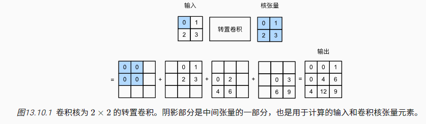

# 动手学深度学习

*Created by KennyS*

---


## 微调

1. 数据集
    - Fashion-MNIST：6w+
    - ImageNet：1000w+, 1000classes

2. 假定我们拥有数据集数量介于两者之间
    - 适用于ImageNet的复杂模型可能会在我们的数据集上过拟合
    - 而我们的数据集数量有限，训练模型的准确性无法满足实际要求

3. 解决方案
    - 收集更多的数据，但成本高
    - 迁移学习：将源数据集学习到的知识迁移到目标数据集。尽管ImageNet数据集中的大多数图像与椅子无关，但在此数据集上训练的模型可能会提取更通用的图像特征，这有助于识别边缘、纹理、形状和对象组合。 这些类似的特征也可能有效地识别椅子。

### 步骤

1. 在源数据集（例如ImageNet数据集）上预训练神经网络模型，即源模型。

2. 创建一个新的神经网络模型，即目标模型。这将复制源模型上的所有模型设计及其参数（输出层除外）。我们假定这些模型参数包含从源数据集中学到的知识，这些知识也将适用于目标数据集。我们还假设源模型的输出层与源数据集的标签密切相关；因此不在目标模型中使用该层。

3. 向目标模型添加输出层，其输出数是目标数据集中的类别数。然后随机初始化该层的模型参数。

4. 在目标数据集（如椅子数据集）上训练目标模型。输出层将从头开始进行训练，而所有其他层的参数将根据源模型的参数进行微调。

5. 当目标数据集比源数据集小得多时，微调有助于提高模型的泛化能力。

### 示例

1. 基于ImageNet训练的ResNet-18微调自己的数据集
2. 特征层参数使用预训练权重，修改分类层（输出类别数）
3. 在目标数据集较小的情况下，使用小学习率微调

    ```python
    pretrained_net = torchvision.models.resnet18(pretrained=True)
    finetune_net = torchvision.models.resnet18(pretrained=True)
    finetune_net.fc = nn.Linear(finetune_net.fc.in_features, 2)
    nn.init.xavier_uniform_(finetune_net.fc.weight) # 初始化分类层的参数

    # 如果param_group=True，输出层中的模型参数将使用十倍的学习率
    def train_fine_tuning(net, learning_rate, batch_size=128, num_epochs=5,
                        param_group=True):
        train_iter = torch.utils.data.DataLoader(torchvision.datasets.ImageFolder(
            os.path.join(data_dir, 'train'), transform=train_augs),
            batch_size=batch_size, shuffle=True)
        test_iter = torch.utils.data.DataLoader(torchvision.datasets.ImageFolder(
            os.path.join(data_dir, 'test'), transform=test_augs),
            batch_size=batch_size)
        devices = d2l.try_all_gpus()
        loss = nn.CrossEntropyLoss(reduction="none")
        if param_group:
            params_1x = [param for name, param in net.named_parameters()
                if name not in ["fc.weight", "fc.bias"]]
            trainer = torch.optim.SGD([{'params': params_1x},
                                    {'params': net.fc.parameters(),
                                        'lr': learning_rate * 10}],
                                    lr=learning_rate, weight_decay=0.001)
        else:
            trainer = torch.optim.SGD(net.parameters(), lr=learning_rate,
                                    weight_decay=0.001)
        d2l.train_ch13(net, train_iter, test_iter, loss, trainer, num_epochs,
                    devices)

    train_fine_tuning(finetune_net, 5e-5)
    ```

---

## 目标检测

1. 得到目标类别 + 位置

### 边界框

1. 描述目标空间位置，矩形
    - 左上角和右下角的x，y
    - 边界框中心的(x, y)以及框的宽度、高度
    - 坐标系原点在左上角, x轴向右为正, y轴向下为正

    ```python
    #@save
    def box_corner_to_center(boxes):
        """从（左上，右下）转换到（中间，宽度，高度）"""
        x1, y1, x2, y2 = boxes[:, 0], boxes[:, 1], boxes[:, 2], boxes[:, 3]
        cx = (x1 + x2) / 2
        cy = (y1 + y2) / 2
        w = x2 - x1
        h = y2 - y1
        boxes = torch.stack((cx, cy, w, h), axis=-1)
        return boxes

    #@save
    def box_center_to_corner(boxes):
        """从（中间，宽度，高度）转换到（左上，右下）"""
        cx, cy, w, h = boxes[:, 0], boxes[:, 1], boxes[:, 2], boxes[:, 3]
        x1 = cx - 0.5 * w
        y1 = cy - 0.5 * h
        x2 = cx + 0.5 * w
        y2 = cy + 0.5 * h
        boxes = torch.stack((x1, y1, x2, y2), axis=-1)
        return boxes

    #@save
    def bbox_to_rect(bbox, color):
        # 将边界框(左上x,左上y,右下x,右下y)格式转换成matplotlib格式：
        # ((左上x,左上y),宽,高)
        return d2l.plt.Rectangle(
            xy=(bbox[0], bbox[1]), width=bbox[2]-bbox[0], height=bbox[3]-bbox[1],
            fill=False, edgecolor=color, linewidth=2)
    ```

### 锚框

1. 目标检测算法通常会在输入图像中采样大量的区域，然后判断这些区域中是否包含我们感兴趣的目标，并调整区域边界从而更准确地预测目标的真实边界框（ground-truth bounding box）

2. 不同的模型使用的区域采样方法可能不同。这里我们介绍其中的一种方法：以每个像素为中心，生成多个缩放比和宽高比（aspect ratio）不同的边界框。这些边界框被称为锚（anchor box）

### 生成多个锚框

1. 输入图像的大小为$h \times w$，以图像的每个像素为中心生成不同形状的锚框：缩放比为$s \in (0,1]$，宽高比$r > 0$，那么锚框的宽高分别为$hs \sqrt{r}$和$\frac{hs}{\sqrt{r}}$。注意，当中心位置给定时，已知宽高的锚框是确定的

2. 当使用所有比例和长宽比组合时，输入图像总共有$whnm$个锚框，尽管这些锚框可能会覆盖所有真实边界框，但计算复杂性很容易过高。在实践中，只考虑包含$s_{1}$或$r_{1}$的组合

$$
(s_{1},r_{1}),...,(s_{1},r_{m}),...,(s_{n},r_{1})
$$

3. 也就是说, 以同一像素为中心的锚框的数量是$n+m-1$。对于整个输入图像，将共生成$wh(n+m-1)$个锚框。

### 交并比

1. 量化锚框和真是边界框的覆盖程度（相似性）：*杰卡德系数(Jaccard)*，给定集合$\mathcal{A}$和$\mathcal{B}$

$$
J(\mathcal{A},\mathcal{B}) = \frac{|\mathcal{A} \cap \mathcal{B}|}{|\mathcal{A} \cup \mathcal{B}|}
$$

2. 将边界框的像素区域视为一组像素，通过像素集的杰卡德系数来测量边界框的相似性，通常称为*交并比*(Intersection over Union, IoU)

    ```python
    #@save
    def box_iou(boxes1, boxes2):
        """计算两个锚框或边界框列表中成对的交并比"""
        box_area = lambda boxes: ((boxes[:, 2] - boxes[:, 0]) *
                                (boxes[:, 3] - boxes[:, 1]))
        # boxes1,boxes2,areas1,areas2的形状:
        # boxes1：(boxes1的数量,4),
        # boxes2：(boxes2的数量,4),
        # areas1：(boxes1的数量,),
        # areas2：(boxes2的数量,)
        areas1 = box_area(boxes1)
        areas2 = box_area(boxes2)

        # inter_upperlefts,inter_lowerrights,inters的形状:
        # (boxes1的数量,boxes2的数量,2)
        inter_upperlefts = np.maximum(boxes1[:, None, :2], boxes2[:, :2])
        inter_lowerrights = np.minimum(boxes1[:, None, 2:], boxes2[:, 2:])
        inters = (inter_lowerrights - inter_upperlefts).clip(min=0)
        # inter_areasandunion_areas的形状:(boxes1的数量,boxes2的数量)
        inter_areas = inters[:, :, 0] * inters[:, :, 1]
        union_areas = areas1[:, None] + areas2 - inter_areas
        return inter_areas / union_areas
    ```

### 训练数据中标注锚框

1. 训练集中，将每个锚框视为一个训练样本。对于目标检测而言，需要每个锚框的*类别*(class)和*偏移量*(offset，真实边界框相对于锚框的偏移量)

### 标记类别和偏移量

1. 给定锚框$A$和真实边界框$B$，中心坐标分别为$(x_{a},y_{b})$和$(x_{b},y_{b})$，宽度分别为$w_{a}$和$w_{b}$，高度为$h_{a}$和$h_{b}$，将$A$的偏移量标记为：

$$
(\frac{\frac{x_{b}-x_{a}}{w_{a}}-\mu_{x}}{\sigma_{x}}, \frac{\frac{y_{b}-y_{a}}{h_{a}}-\mu_{y}}{\sigma_{y}}, \frac{\log\frac{w_{b}}{w_{a}}-\mu_{w}}{\sigma_{w}}, \frac{\log\frac{h_{b}}{h_{a}}-\mu_{h}}{\sigma_{h}})
$$

2. 其中常量的默认值为$\mu_{x}=\mu_{y}=\mu_{w}=\mu_{h}=0, \sigma_{x}=\sigma_{y}=0.1, \sigma_{w}=\sigma_{h}=0.2$

    ```python
    #@save
    def offset_boxes(anchors, assigned_bb, eps=1e-6):
        """对锚框偏移量的转换"""
        c_anc = d2l.box_corner_to_center(anchors)
        c_assigned_bb = d2l.box_corner_to_center(assigned_bb)
        offset_xy = 10 * (c_assigned_bb[:, :2] - c_anc[:, :2]) / c_anc[:, 2:]
        offset_wh = 5 * np.log(eps + c_assigned_bb[:, 2:] / c_anc[:, 2:])
        offset = np.concatenate([offset_xy, offset_wh], axis=1)
        return offset
    ```

### 使用非极大值抑制

1. 当有许多锚框时，可能会输出许多相似的具有明显重叠的预测边界框，都围绕着同一目标。为了简化输出，我们可以使用*非极大值抑制*（non-maximum suppression，NMS）合并属于同一目标的类似的预测边界框

2. 对于一个预测边界框$B$，目标检测模型会计算每个类别的预测概率。假设最大的预测概率为$p$，则该概率所对应的类别$B$即为预测的类别。具体来说，我们将$p$称为预测边界框$B$的*置信度*（confidence）。在同一张图像中，所有预测的非背景边界框都按置信度降序排序，以生成列表$L$。然后我们通过以下步骤操作排序列表$L$

    - 从$L$中选取置信度最高的预测边界框$B_{1}$作为基准，然后将所有与$B_{1}$的IoU超过预定阈值$\epsilon$的非基准预测边界框从$L$中移除。这时，$L$保留了置信度最高的预测边界框，去除了与其太过相似的其他预测边界框。简而言之，那些具有非极大值置信度的边界框被抑制了。
    - 从$L$中选取置信度第二高的预测边界框$B_{2}$作为又一个基准，然后将所有与$B_{2}$的IoU大于$\epsilon$的非基准预测边界框从$L$中移除
    - 重复上述过程，直到$L$中的所有预测边界框都曾被用作基准。此时，$L$中任意一对预测边界框的IoU都小于阈值$\epsilon$；因此，没有一对边界框过于相似
    - 输出列表$L$中的所有预测边界框

    ```python
    #@save
    def nms(boxes, scores, iou_threshold):
        """对预测边界框的置信度进行排序"""
        B = scores.argsort()[::-1]
        keep = []  # 保留预测边界框的指标
        while B.size > 0:
            i = B[0]
            keep.append(i)
            if B.size == 1: break
            iou = box_iou(boxes[i, :].reshape(-1, 4),
                        boxes[B[1:], :].reshape(-1, 4)).reshape(-1)
            inds = np.nonzero(iou <= iou_threshold)[0]
            B = B[inds + 1]
        return np.array(keep, dtype=np.int32, ctx=boxes.ctx)
    ```

## 单发多框检测(SSD)

### 模型

1. Backbone + 多尺度特征块
    - Backbone：提取特征，分类层前截断的VGG
    - 多尺度特征块：增大感受野

    

### 类别预测层

1. 目标类别为$q$，锚框类别有$q+1$个，0类为背景，假设特征图的高和宽分别为$h$和$w$，以其中每个单元为中心生成$a$个锚框，则总共有$hwa$个锚框进行分类。如果使用全连接层作为输出，很容易导致模型参数过多。使用卷积层的通道来输出类别预测，降低模型复杂度

### 边界框预测层

1. 与类别预测层类似，但需要为每个锚框预测4个偏移量，而不是$q+1$个类别


## 区域卷积神经网络（RCNN）

### R-CNN

1. 首先从输入图像中选取若干个（例如2000）提议区域，并标注类别和边界框（偏移量）。然后基于CNN对每个提议区域进行前向传播抽取特征
    - 对输入图像使用选择性搜索选取多个高质量的提议区域（多尺度、不同形状和大小），每个提议区域都被标注类别和真实边界框
    - 选择预训练网络，在输出层前截断，将每个提议区域变形为$target_size$，并提取特征
    - 将每个提议区域的特征连同其标注的类别作为一个样本，训练多个SVM进行目标分类
    - 将每个提议区域的特征连同其标注的边界框作为一个样本，训练LR预测真实边界框

### Fast R-CNN

1. R-CNN的每个提议区域提取特征都是独立的，没有特征共享。Fast R-CNN仅在整张图像上执行CNN的前向传播
    - 输入为整个图像，而不是提议区域
    - 引入ROI-Pooling，输出连结后的各个提议区域抽取的特征
    - 全连接层输出形状变换为$n \times d$，$d$为超参
    - 预测类别和边界框时，全连接层输出转换为$n \times q$和$n \times 4$，预测类别时使用softmax回归

### Faster R-CNN

1. 将选择性搜索替换为区域提议网络（Region Proposal Network）
2. 将ROI_Pooling替换为了ROI对齐层，使用双线性插值保留特征图的空间信息，更适用于像素级预测

### **总结**
1. R-CNN对图像选取若干提议区域，使用卷积神经网络对每个提议区域执行前向传播以抽取其特征，然后再用这些特征来预测提议区域的类别和边界框。

2. Fast R-CNN对R-CNN的一个主要改进：只对整个图像做卷积神经网络的前向传播。它还引入了兴趣区域汇聚层，从而为具有不同形状的兴趣区域抽取相同形状的特征。

3. Faster R-CNN将Fast R-CNN中使用的选择性搜索替换为参与训练的区域提议网络，这样后者可以在减少提议区域数量的情况下仍保证目标检测的精度。

4. Mask R-CNN在Faster R-CNN的基础上引入了一个全卷积网络，从而借助目标的像素级位置进一步提升目标检测的精度。

## 转置卷积

1. 常规卷积层、池化层，通常会减少下采样输入图像的空间维度（高和宽）。
2. 在空间维度被卷积神经网络缩小后，可以使用转置卷积，增加上采样中间层特征图的空间维度。

### 卷积操作

1. 设$stride=1$且没有填充，输入张量为$n_{h} \times k_{w}$，卷积核为$k_{h} \times k_{w}$，每行滑动$n_{w}$次，每列$n_{h}$次，共产生$n_{h}n_{w}$个中间结果。每个结果都是一个$(n_{h}+k_{h}+1) \times (n_{w}+k_{w}+1)$的张量。最后所有的中间结果相加。



2. 转置卷积通过卷积核广播操作输入元素，产生大于输入的输出

### 填充、步幅和多通道

1. 转置卷积填充被应用于输出（常规卷积填充用于输入）。例如，当将高和宽两侧的填充数指定为1时，转置卷积的输出中将删除第一和最后的行与列。
2. 在转置卷积中，步幅被指定为中间结果（输出），而不是输入。将步幅从1更改为2会增加中间张量的高和权重。
3. 对于多个输入和输出通道，转置卷积与常规卷积以相同方式运作。 假设输入有$c_{i}$个通道，且转置卷积为每个输入通道分配了一个$k_{h} \times k_{w}$的卷积核张量。 当指定多个输出通道时，每个输出通道将有一个$c_{i} \times k_{h} \times k_{w}$的卷积核。

### 总结

- 与通过卷积核减少输入元素的常规卷积相反，转置卷积通过卷积核广播输入元素，从而产生形状大于输入的输出。
- 如果我们将$X$输入卷积层$f$来获得输出$Y=f(X)$并创造一个与$f$有相同的超参数、但输出通道数是$X$中通道数的转置卷积层$g$，那么$g(Y)$的形状将与$X$相同。
- 我们可以使用矩阵乘法来实现卷积。转置卷积层能够交换卷积层的正向传播函数和反向传播函数。

## 词嵌入(word2vec)

### 糟糕的独热向量

1. 独热向量容易构建，但不能准确表达不同词之间的相似度，例如余弦相似度，任意两个不同词的独热向量的余弦相似度为0

$$
\frac {x^{T}y}{||x||||y||} \in [-1,1]
$$

### 自监督的word2vec

1. word2vec将每个词映射到固定长度的向量，能更好的表达不同词之间的相似性和类比关系
    - 跳元模型（skip-gram）
    - 连续词袋（CBOW）
2. 对于在语义上有意义的表示，它们的训练依赖于条件概率，条件概率可以被看作使用语料库中一些词来预测另一些单词。由于是不带标签的数据，因此跳元模型和连续词袋都是自监督模型

#### 跳元模型（skip-gram）

