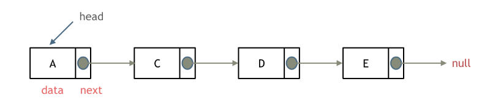
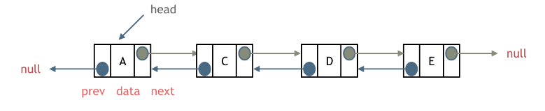
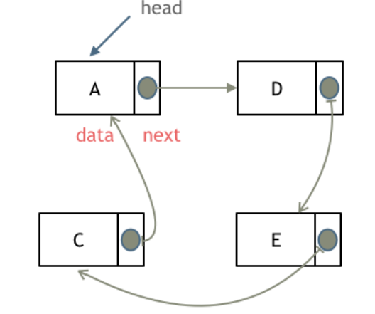
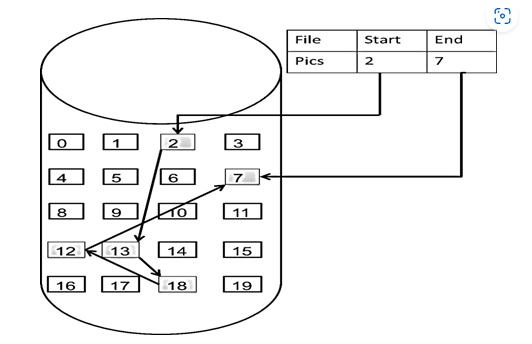
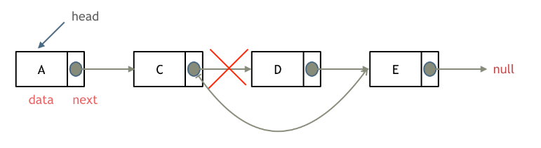
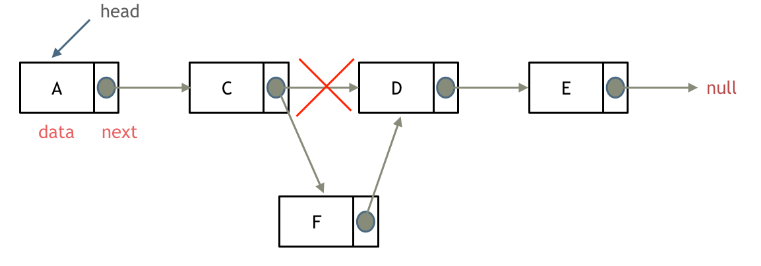

# LeetCode刷题

*Created by KennyS*

LeetCode算法

---


## 记录

### 1. 数组

#### 1.1 数组理论基础

1.1.1 数组是存放在连续内存空间上的相同类型数据的集合

- 数组下标都是从0开始
- 数组内存空间的地址是连续的

1.1.2 数组内存空间是连续的, 所以在删除和增添元素的时候, 需要移动其他元素的地址

注意：C++中, 需要注意vector和array的区别, vector的底层实现是array, 严格讲vector是容器, 不是数组

1.1.3 数组元素不能删除, 只能覆盖

参考二维数组

1.1.4 二维数组在C++中的空间地址

```cpp
void test_arr(){
    int array[2][3] = {
        {0, 1, 2},
        {3, 4, 5}
    };
    cout << &array[0][0] << " " << &array[0][1] << " " << &array[0][2] << endl;
    cout << &array[1][0] << " " << &array[1][1] << " " << &array[1][2] << endl;
}

int main(){
    test_arr();
}
```

输出:
> 0x7ffee4065820 0x7ffee4065824 0x7ffee4065828
0x7ffee406582c 0x7ffee4065830 0x7ffee4065834

注意：地址为16进制, 相邻元素就差了4个字节, 由于这是个int型数组, 故连续

---

#### 1.2 二分查找

**问题**：给定一个n个元素的有序（升序）整型数组nums, 和一个目标值target, 写一个函数搜索nums中的target, 如果目标值存在, 则返回下标, 否则返回-1

```
示例1：
输入： nums = [-1, 0, 3, 5, 9, 12], target = 9
输出： 4
```

```
示例2：
输入： nums = [-1, 0, 3, 5, 9, 12], target = 2
输出： -1
```

**提示**：
- 假设nums中的元素是不重复的
- n在[1, 10000]之间
- nums的每个元素都在[-9999, 9999]之间

**解题思路：**

1. **前提是数组为有序数组, 数组中无重复元素**, 一旦有重复元素, 二分法返回的下标可能不唯一, 这些都是二分法使用的前提条件

2. 二分查找涉及很多的边界条件, 需要考虑 `while(left < right)`, `while(left <= right)`, `right = middle`, `right = middle - 1`

3. 区间的定义就是不变量, 在二分查找的过程中保持不变量, 在while寻找中每一次边界的处理都要坚持根据区间的定义来操作

4. 二分法区间定义分为两种：左闭右闭 -> [left, right]; 左闭右开 -> [left, right)


**两种写法**


1. target定义在左闭右闭 -> [left, right]

因为target在[left, right]区间中, 所以有如下两点：

- while(left <= right), 因为left = right是有意义的
- if(nums[middle] > target), right要赋值为middle-1, 因为当前这个nums[middle]一定不是target, 那么接下来要查找的左区间结束下标位置就是middle-1 

```cpp
class Solution{
public:
    int search(vector<int>& nums, int target){
        int left = 0;
        int right = nums.size() - 1; // [left, right]
        while(left <= right){
            int middle = (left + right) / 2;
            if (nums[middle] > target){
                right = middle - 1;
            } else if (nums[middle] < target){
                left = middle + 1;
            } else {
                return middle;
            }
        }
        return -1;
    }
};
```

```python
class Solution:
    def search(self, nums:List[int], target:int) -> int:
        left, right = 0, len(nums) - 1 
        while(left <= right):
            middle = (left + right) // 2
            if (nums[middle] > target):
                right = middle - 1
            elif (nums[middle] < target):
                left = middle + 1;
            else:
                return middle;
        return -1
```

2. target定义在左闭右开 -> [left, right)

有如下两点

- while(left < right), left无法等于right
- if (nums[middle] > target), right更新为middle, 因为当前nums[middle]不等于target, 去左区间继续寻找, 而寻找区间是左闭右开区间, 所以right更新为middle, 即：下一个查询区间不会去比较

```cpp
class Solution{
public:
    int search(vector<int>& nums, int target){
        int left = 0;
        int right = nums.size(); // [left, right)
        while(left < right){
            int middle = (left + right) / 2;
            if (nums[middle] > target){
                right = middle;
            } else if (nums[middle] < target){
                left = middle + 1;
            } else {
                return middle;
            }
        }
        return -1;
    }
};
```


#### 1.3 移除元素

**问题**：给你一个数组 nums 和一个值 val，你需要 原地 移除所有数值等于 val 的元素，并返回移除后数组的新长度

**解题思路**：

1. 数组是连续的、元素类型相同的数据结构

2. 移除某一个元素，需要将其覆盖，而不是直接删除，对于最后个元素不做处理

3. 类似于`vector.size`中的`erase`函数，是个O(n)操作


**暴力解法**

```cpp
for (数组大小){
    for (target后的元素, 向前覆盖)
}
```

**双指针思路**

- 新数组中不包含`target`
- 同一数组构建两个指针
    - fast: 新数组需要的元素
    - slow: 新数组下标

```cpp
int slow = 0;
for (int fast = 0; fast < nums.size(); fast++) {
    if (nums[fast] != target){
        nums[slow] = nums[fast];
        slow++;
    }
}
return slow;
```


#### 1.4 有序数组的平方

**问题**：给你一个按 非递减顺序 排序的整数数组 nums，返回 每个数字的平方 组成的新数组，要求也按 非递减顺序 排序

**解题思路**：

1. 原数组有序，从小到大，存在负数，平方后最大值只能出现在两边，不可能在中间

**暴力解法**

1. 数组元素平方
2. 排序算法

**双指针思路**

1. 定义首尾两个指针，逐步向中间靠拢，数组的值由大到小

```cpp
vector<int> & nums; //定义原数组
vector<int> result(nums.size(), 0); // 定义结果
int k = nums.size() - 1;
for (int i=0; j=nums.size()-1; i <= j){
    if nums[i]*nums[i] > nums[j]*nums[j]{
        result[k--] = nums[i]*nums[i];
        i++;
    }
    else{
        result[k--] = nums[j]*nums[j];
        j--;
    }
}
return result;
```


```python
class Solution:
    def sortedSquares(self, nums: List[int]) -> List[int]:
        result = [float('inf')]*len(nums)
        # result = list(range(len(nums)))
        i, j, k = 0, len(nums)-1, len(nums)-1
        while i <= j:
            if nums[i]**2 > nums[j]**2:
                result[k] = nums[i]**2
                i+=1
            else:
                result[k] = nums[j]**2
                j-=1
            k-=1
        return result
```


#### 1.5 长度最小的数组

**问题**：给定一个含有 n 个正整数的数组和一个正整数 s ，找出该数组中满足其和 ≥ s 的长度最小的 连续 子数组，并返回其长度。如果不存在符合条件的子数组，返回 0


**暴力解法**：

1. 2个for循环，一个循环起始位置，一个循环终止位置


**滑动窗口(双指针)**

1. 1个for循环做2个for循环的事情

- 如果第一个for循环的j指向的是起始位置，那么另一个只能指向终止位置，那么此时和暴力解法则相似，因此j只能指向终止位置

2. 实现滑动窗口

- 窗口内是什么 -> 窗口内的元素和，和给定的target比较
- 如何移动窗口的起始位置 -> 如果窗口值大于等于target，窗口就要向前移动
- 如何移动窗口的终止位置 -> 窗口的终止位置就是遍历数组的指针

**注意**：if判断一次就终止，而本题需要持续滑动窗口直到满足条件，因此使用while


```cpp
class Solution{
public:
    int minSubArrayLen(int target, vector<int>& nums){
        int result = INT32_MAX; // cpp中的MAX
        int sum = 0; // 窗口内元素和
        int i = 0; // 起始位置
        int subL = 0; // 滑窗的长度
        for (int j = 0; j < nums.size(); j++){
            sum += nums[j];
            while (sum >= target){
                subL = j - i + 1;
                result = result < subL ? result : subL;
                sum -= nums[i];
                i--;
            }
        }
        return result == INT32_MAX ? 0 : result;
    }
}
```

```python
class Solution:
    def minSubArrayLen(self, s: int, nums: List[int]) -> int:
        l = len(nums)
        left = 0
        right = 0
        min_len = float('inf')
        cur_sum = 0 #当前的累加值
        
        while right < l:
            cur_sum += nums[right]
            
            while cur_sum >= s: # 当前累加值大于目标值
                min_len = min(min_len, right - left + 1)
                cur_sum -= nums[left]
                left += 1
            
            right += 1
        
        return min_len if min_len != float('inf') else 0
```


#### 1.6 螺旋矩阵

**问题**： 给定一个正整数 n，生成一个包含 1 到 n^2 所有元素，且元素按顺时针顺序螺旋排列的正方形矩阵


**思路**： 
- 模拟转圈过程，需要考虑很多边界问题
- 采用左闭右开的区间，处理第一个节点，不处理最后一个节点，留给下一条边，作为第一个节点处理


```cpp
class Solution {
public:
    vector<vector<int>> generateMatrix(int n) {
        vector<vector<int>> res(n, vector<int>(n, 0)); // 使用vector定义一个二维数组
        int startx = 0, starty = 0; // 定义每循环一个圈的起始位置
        int loop = n / 2; // 每个圈循环几次，例如n为奇数3，那么loop = 1 只是循环一圈，矩阵中间的值需要单独处理
        int mid = n / 2; // 矩阵中间的位置，例如：n为3， 中间的位置就是(1，1)，n为5，中间位置为(2, 2)
        int count = 1; // 用来给矩阵中每一个空格赋值
        int offset = 1; // 需要控制每一条边遍历的长度，每次循环右边界收缩一位
        int i,j;
        while (loop --) {
            i = startx;
            j = starty;

            // 下面开始的四个for就是模拟转了一圈
            // 模拟填充上行从左到右(左闭右开)
            for (j; j < n - offset; j++) {
                res[i][j] = count++;
            }
            // 模拟填充右列从上到下(左闭右开)
            for (i; i < n - offset; i++) {
                res[i][j] = count++;
            }
            // 模拟填充下行从右到左(左闭右开)
            for (; j > starty; j--) {
                res[i][j] = count++;
            }
            // 模拟填充左列从下到上(左闭右开)
            for (; i > startx; i--) {
                res[i][j] = count++;
            }

            // 第二圈开始的时候，起始位置要各自加1， 例如：第一圈起始位置是(0, 0)，第二圈起始位置是(1, 1)
            startx++;
            starty++;

            // offset 控制每一圈里每一条边遍历的长度
            offset += 1;
        }

        // 如果n为奇数的话，需要单独给矩阵最中间的位置赋值
        if (n % 2) {
            res[mid][mid] = count;
        }
        return res;
    }
};
```


### 2. 链表

#### 2.1 链表理论基础

1. 链表定义：
    - 一种通过指针串联在一起的线性结构
    - 两部分组成：数据域 & 指针域（存放指向下一个结点的指针），最后一个节点的指针域指向null




2. 链表类型

- 单链表：指针域只能指向节点的下一个节点
- 双链表：每一个节点有两个指针域，一个指向下一个节点，一个指向上一个节点；双链表既可以向前查询，也可以向后查询



- 循环链表：链表首尾相连，可以用来解决约瑟夫环问题




3. 链表存储方式

- 数组在内存中是连续分布的
- 链表在内存中不是连续分布的
- 链表通过指针域的指针链接在内存中各个节点




4. 链表定义code

```cpp
//单链表
struct ListNode{
    int val; // 节点上存储的元素
    ListNode *next; // 指向下一个节点的指针
    ListNode(int x): val(x), next(NULL){}
};
```


5. 链表操作

- 删除节点: 在C++中最好手动释放D节点内存



- 增加节点：




6. 性能分析

|  |插入/删除时间复杂度|查询时间复杂度|适用场景|
|---|:---:|:---:|:---:|
|数组|O(n)|O(1)|数据量固定、频繁查询、较少增删|
|链表|O(1)|O(n)|数据量不固定，频繁增删、较少查询|


#### 2.2 移除链表元素

**问题**：删除链表中等于给定值 val 的所有节点。

**两种方式**：

- 直接使用原来链表进行删除操作
- 设置虚拟头结点进行删除操作

1. 第一种

- 需要判断是否是头结点：链表其他结点都是通过前一个结点来移除当前结点，而头结点没有前一个结点
- 移除头结点：将头结点向后移动一位
- 手动释放移除的结点内存

2. 第二种：设置虚拟头结点

- 设置虚拟头结点，链表所有结点都可以按照统一的方式进行处理

```cpp
class Solution{
public:
    ListNode* removeElements(ListNode* head, int val){
        ListNode* dummyHead = new ListNode(0);
        dummyHead->next = head;
        ListNode* cur = dummyHead;
        while (cur->next != NULL){
            if (cur->next>val == val){
                ListNode* tmp = cur->next;
                cur->next = cur->next->next;
                delete tmp;
            }
            else{
                cur = cur->next;
            }
        }
        head = dummyHead->next;
        delete dummyHead;
        return head;
    }
};
```