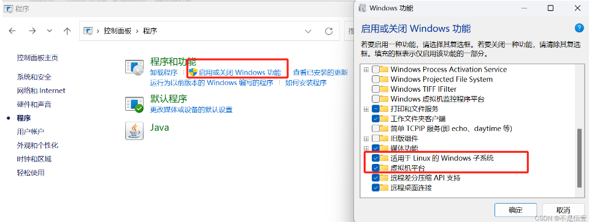
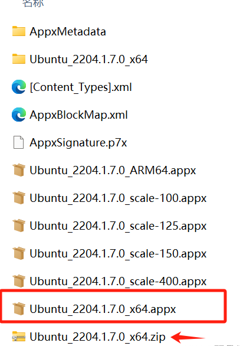
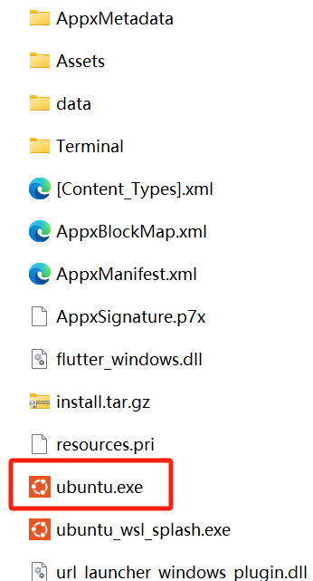
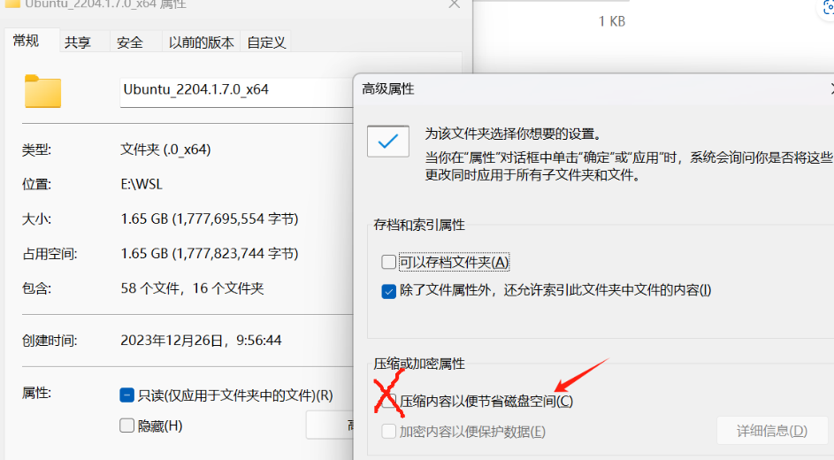

# WSL2 自定义安装

*Created by KennyS*

---


## 参考

[WSL2自定义安装](https://blog.csdn.net/weixin_48076899/article/details/135214749)
[WSL2安装教程](https://blog.csdn.net/qq_43556844/article/details/120602402)

---

## WSL概念

- Windows Subsystem for Linux，适用于 Linux 的 Windows 子系统可让开发人员按原样运行 GNU/Linux 环境 - 包括大多数命令行工具、实用工具和应用程序 - 且不会产生虚拟机开销。
- WSL 2 是 WSL 中体系结构的新版本，它更改 Linux 发行版与 Windows 交互的方式。
- WSL 2 的主要目标是提高文件系统性能并增加系统调用的完全兼容性。每个 Linux 发行版都可以作为 WSL 1 或 WSL 2 发行版运行，并可随时进行切换。
- WSL 2 是底层体系结构的主要功能，它使用虚拟化技术和 Linux 内核来实现其新功能

---

## 子系统虚拟化



---

## 手动安装

### 安装内核更新

`wsl --update`

### 设置默认的WSL版本

- 只使用WSL2，管理员方式运行POWERSHELL
```
# 将 WSL 默认版本设置为 WSL 2
wsl --set-default-version 2
```

- 手动下载Ubuntu22.04或者微软商店下载
    - 手动下载得到一个后缀名为.AppxBundle的文件，将后缀改成.zip，并解压
    

    - 解压后文件夹有一个后缀名为.appx的文件，将后缀改成.zip，再次解压
    

    - 将文件夹移动到想要安装的路径中，解压后文件夹得到一个.exe文件，双击运行；
需要注意的是：安装目录的磁盘不能开压缩内容以便节省磁盘空间选项，否则会报错
可以右键文件夹–>属性–>常规–>高级找到并关闭这个选项
    

---

## 一些安装

1. 需要win10+wsl2

    - 虚拟机
    - bios
    - 或者控制面板+程序+启用或关闭win功能 -> 虚拟机平台+Windows子系统Linux

2. powershell 管理员
    ```bash
    dism.exe /online /enable-feature /featurename:Microsoft-Windows-Subsystem-Linux /all /norestart
    dism.exe /online /enable-feature /featurename:VirtualMachinePlatform /all /norestart
    ```

3. 重启电脑

4. wsl2设为默认
    `wsl --set-default-version 2`

5. 在e盘创建e://wsl，迁移至e盘
    ```bash
    Invoke-WebRequest -Uri https://wsldownload.azureedge.net/Ubuntu_2004.2020.424.0_x64.appx -OutFile Ubuntu20.04.appx -UseBasicParsing

    Rename-Item .\Ubuntu20.04.appx Ubuntu.zip
    Expand-Archive .\Ubuntu.zip -Verbose
    cd .\Ubuntu\
    .\ubuntu2004.exe
    ```

6. 更改默认用户root为自己
    - 进入root
    `sudo adduser username`
    `sudo usermod -aG sudo username`
    - 设置
    `ubuntu2204.exe config --default-user username`