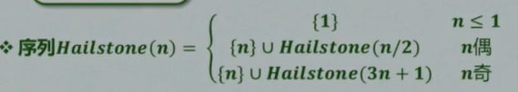
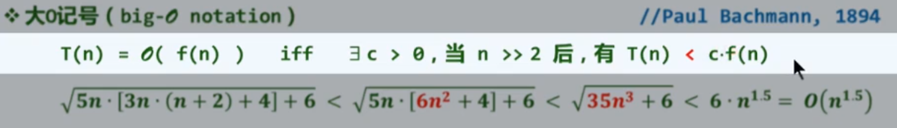

# 数据结构

*Created by KennyS*

[数据结构大课-清华邓俊辉](https://www.bilibili.com/video/BV1C54y1L7JM/?spm_id_from=333.337.search-card.all.click&vd_source=f007ff194d374ddfb484e469e9ee2e1f)


---


## 1. 绪论


### 1.1 计算

    - 对象：规律、技巧
    - 目标：高效、低耗


### 1.2 绳索计算机及其算法

输入：任给直线l及其上一点A
输出：经过A做l的一条垂线

算法：取12段等长的绳索，首尾链接成环


### 1.3 尺规计算机


### 1.4 算法

1. 计算 = 信息处理
    - 借助某种工具，遵照一定规则，以明确而机械的形式进行

2. 计算模型 = 计算机 = 信息处理工具

3. 算法：在特定计算模型下，解决特定问题的指令序列
    - 输入：待处理的信息 -> 问题
    - 输出：经处理的信息 -> 答案
    - 正确性：可以解决指定的问题
    - 确定性：任一算法都可以描述为一个由基本操作组成的序列
    - 可行性：每一基本操作都可以实现，在常数时间内完成
    - 有穷性：对于任何输入，经过有穷次基本操作，都可以得到输出


3. 计算Hailstion序列长度



```cpp
int hailstone(int n){
    int length = 1;
    while(1 < n) {
        (n % 2) ? n=3*n+1 : n/=2;
        length++;
    }
    return length;
}
```

但是，对于任意的n，并没有Hailstone序列的长度是有穷的，所以上述代码未必是一个算法

***程序 不等于 算法*** -> 死循环 或者 栈溢出


### 1.5 好算法

1. 正确：符合语法，能够编译、链接
    - 能够正确处理简单的输入
    - 能够正确处理大规模的输入
    - 能够正确处理一般性的输入
    - 能够正确处理退化的输入
    - 能够正确处理任意合法的输入

2. 健壮：能辨别不合法的输入并做适当处理，而不至于非正常退出

3. 可读：结构化 + 准确命名 + 注释 + ...

4. 效率：速度尽可能快；存储空间尽可能少 


### 2.1 计算模型

1. 引入理想、统一、分层次的尺度

2. 运用该尺度，测量DSA的性能


### 2.2 算法分析

1. 两个主要方面：
    - 正确性：算法功能与问题要求一致；数学证明
    - 成本：运行时间 + 存储空间

2. 考察 $T_{A}(P) = 算法A求解问题实例P的计算成本$

3. 归纳概括：划分等价类

4. 观察：问题实例的规模，往往是决定计算成本的主要因素

5. 通常：规模接近，计算成本也接近；规模扩大，计算成本亦上升


### 2.3 特定算法+不同实例

1. 令 $T_{A}(n) = 用算法A求解某一问题规模为n的实例$， 所需的计算成本讨论特定算法A时，记作$T(n)$

2. 这一定义仍然有问题

3. 观察：同一问题等规模的不同实例，计算成本不尽相同，甚至有实质差别

4. 既然如此，如何定义 $T(n)$

5. 稳妥起见，取 $T(n) = max{T(P) | |P| = n}$，即在规模同为n的所有实例中，只关注最坏(成本最高)者


### 2.4 理想模型

1. 同一问题通常由多种算法，如何评判优劣

2. 实验统计是最直接的方法，但不能正确反映算法的整整效率

3. 实验设计不充分

4. 为给出客观的评判，需要抽象出一个理想的平台或模型，不依赖于种种具体的因素，直接而准确的描述、测量并评价算法


### 2.5 图灵机模型


1. Tape：依次均匀划分为单元格，各注有某一字符，默认为 "#"

2. Alphabet：字符种类有限

3. Head：总是对准某一单元格，并可读取和改写其中的字符，没经过一个节拍，可转向左侧或右侧的邻格

4. State：TM总是处理有限种状态的某一种，每经过一个节拍，可按照规则转向另一种状态

5. Transition Function：（q, c; d, L/R, p）
    - q, c：当前状态q，当前字符为c
    - 将当前字符改写为d，转向左侧/右侧的邻格，转入状态p
    - 一旦进入特定状态h，则停机


### 2.6 图灵机实例

1. 功能：二进制非负整数加一


### 2.7 RAM模型

Random Access Machine

1. 寄存器顺序编号，总数没有限制：R[0], R[1] ....

2. 每一基本操作仅需常数时间


### 2.8 RAM实例

1. 功能：向下取整的除法


### 3.1 大O记号

渐进分析：大O记号

1. 随着问题规模的增长，计算成本如何增长

2. 渐进分析：在问题规模足够大后，计算成本如何增长

3. 当n >> 2后，对于规模为n输入，算法
    - 需执行的基本操作次数： $T(n) = ?$
    - 需占用的存储单元数： $S(n) = ?$

4. 大O记号



1. 常系数可忽略：$O(f(n)) = O(c × f(n))$

2. 低次项可忽略： $O(n^{a} + n^{b}) = O(n^{a}), a > b > 0$


### 3.2 高效解

1. 常数复杂度: 这类算法的效率最高
    - 2 = 2013 = 2013 * 2013 = O(1)
    - 甚至 $2013 ^{2013} = O(1)$

2. 代码不含转向(循环、调用、递归), 必顺序执行, 即O(1)

3. 对数复杂度 O(logn): 这类算法非常有效, 复杂度无限接近于常数
    - 常底数无所谓, $lnn|lgn|log_{100}n|$
    - 常数次幂无所谓
    - 对数多项式


### 3.3 有效解

1. 多项式: 这类算法效率通常认为可令人满意
    - 100n + 200 = O(n)
    - $(100n - 500)(20n^{2} - 300n + 2013) = O(n * n^{2}) = O(n^{3})$

2. 线性: 所有O(n)类函数


### 3.4 难解

1. 指数复杂度: $T(n) = a^{n}$, 这类算法的计算成本增长极快, 不可忍受
    - $1.000001^{n} = O(n^{1000})$

